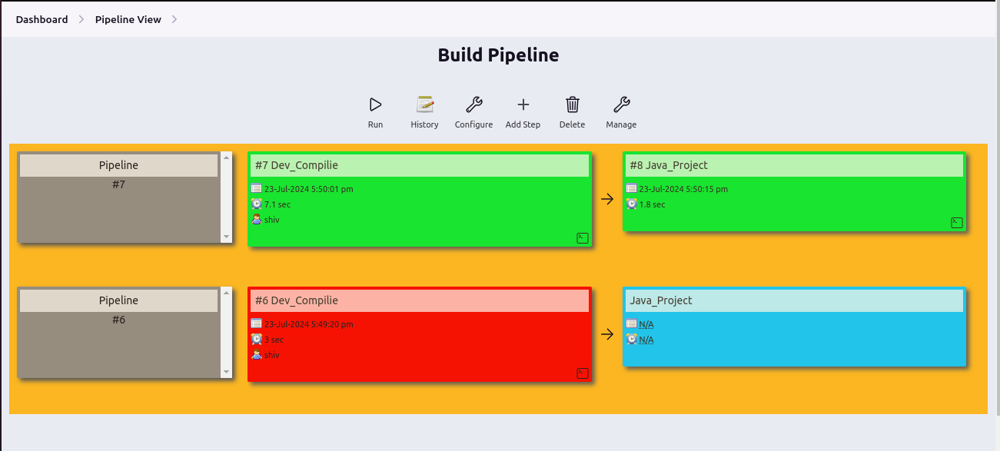

# Day 11 Task

#### Project Overview - Create a private git repo that has a maven project. In Jenkins create 2 freestyle project, one to compile that maven project and other to test that maven project. Create a pipeline view of the project.

---

### Step 1. Private Git Repo

Creating private git repo

Generating personal access token

### Step 2. Compile maven project

Creating new freestyle project to 

### Step 3. Test maven project

Configuring free style project

Build "maven-project-compile" Project

### Step 4. Pipeline view

