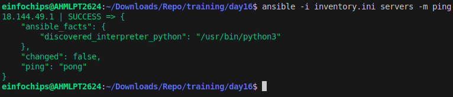
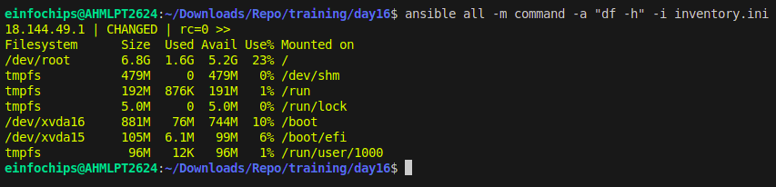
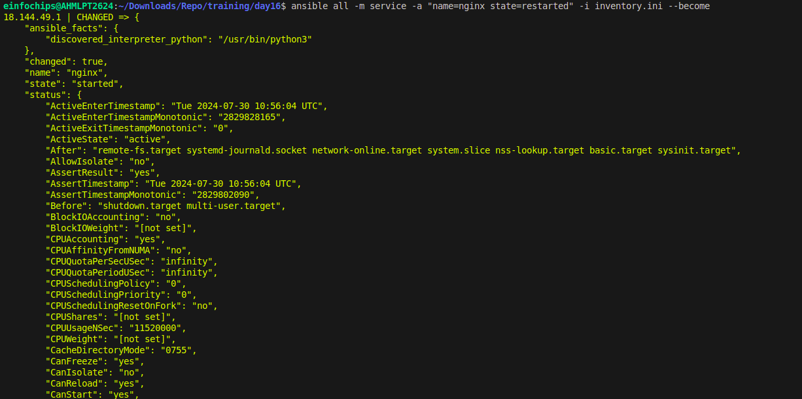
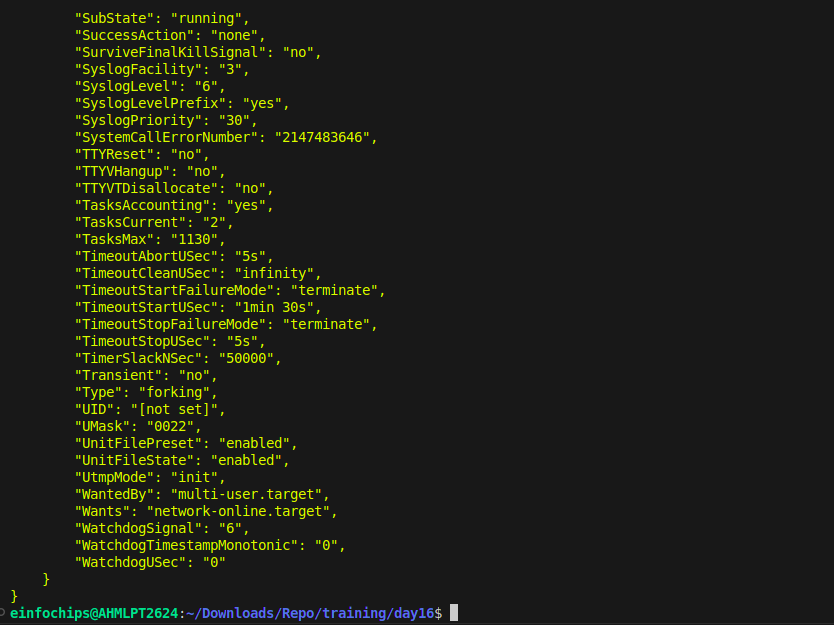
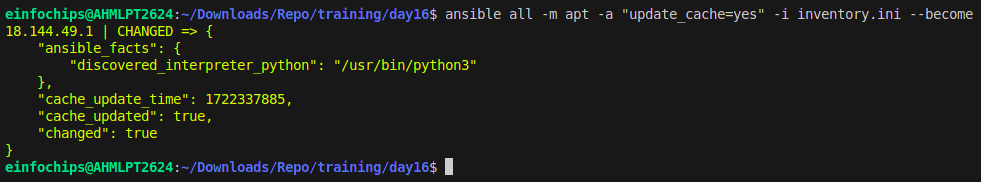
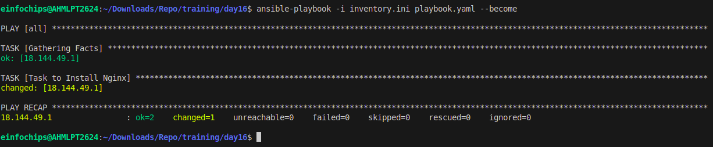
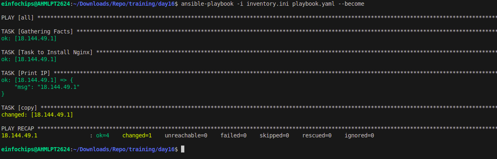
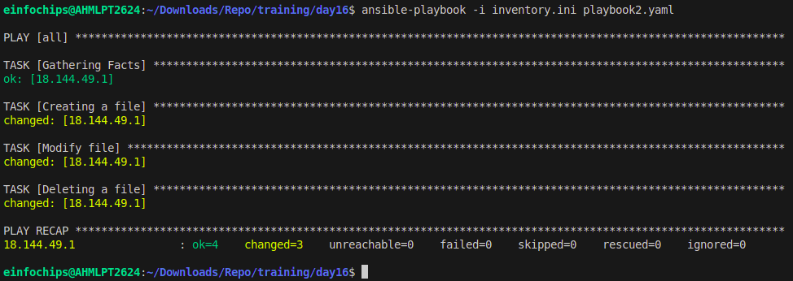
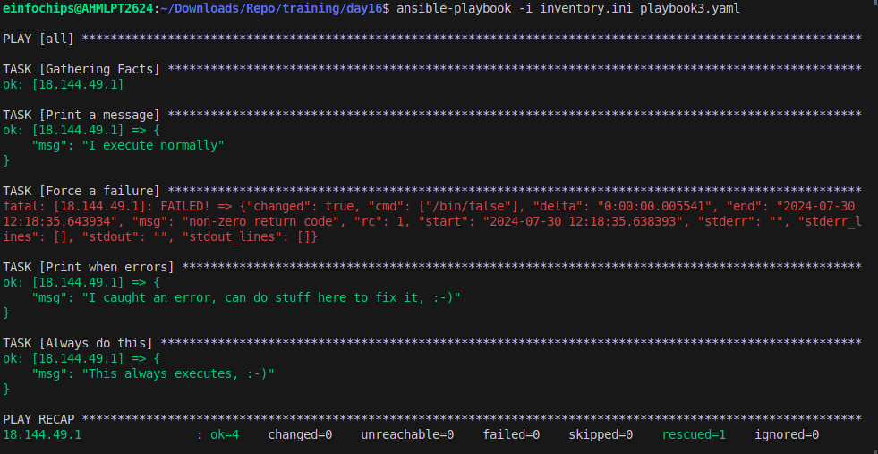

## Project 2: Ad-Hoc Ansible Commands
Problem Statement: Your organization needs to perform frequent, one-off administrative tasks across a fleet of servers. These tasks include checking disk usage, restarting services, and updating packages. You are required to use Ansible ad-hoc commands to accomplish these tasks efficiently.
```
ansible -i inventory -m ping all
```
 
- Execute commands to check disk usage across all managed nodes.
```
ansible -m command -a "df -h" -i inventory
```

- Restart a specific service on all managed nodes.



- Update all packages on a subset of managed nodes


## Project 4: Ansible Playbooks: The Basics
- Write a playbook to install a specific package on all managed nodes.
```
---
- hosts: all
  tasks:
    - name: Task to Install Nginx
      ansible.builtin.apt:
        name: nginx
        state: present
```

- Create a playbook to configure a service with specific parameters.
```
---
- hosts: all
  tasks:
    - name: Task to Install Nginx
      ansible.builtin.apt:
        name: nginx
        state: present
    - name:
      copy: 
        src: index.html.j2
        dest: /var/www/html/index.html
```

- Develop a playbook to manage files, such as creating, deleting, and modifying files on managed nodes.
```
---
- hosts: all
  tasks:
    - name: Creating a file
      file:
        path: index.html
        state: touch
    - name: Modify file
      lineinfile:
        path: index.html
        line: Nginx is running from {{ansible_host}} server
    - name: Deleting a file
      file:
        path: index.html
        state: absent
```



## Project 5: Ansible Playbooks - Error Handling
- Write a playbook that includes tasks likely to fail, such as starting a non-existent service or accessing a non-existent file.
- Implement error handling strategies using modules like block, rescue, and always.
```
---
- hosts: all
  tasks:
  - name: Handle the error
    block:
      - name: Print a message
        ansible.builtin.debug:
          msg: 'I execute normally'

      - name: Force a failure
        ansible.builtin.command: /bin/false

      - name: Never print this
        ansible.builtin.debug:
          msg: 'I never execute, due to the above task failing, :-('
    rescue:
      - name: Print when errors
        ansible.builtin.debug:
          msg: 'I caught an error, can do stuff here to fix it, :-)'
    always:
       - name: Always do this
         ansible.builtin.debug:
           msg: "This always executes, :-)"
```
