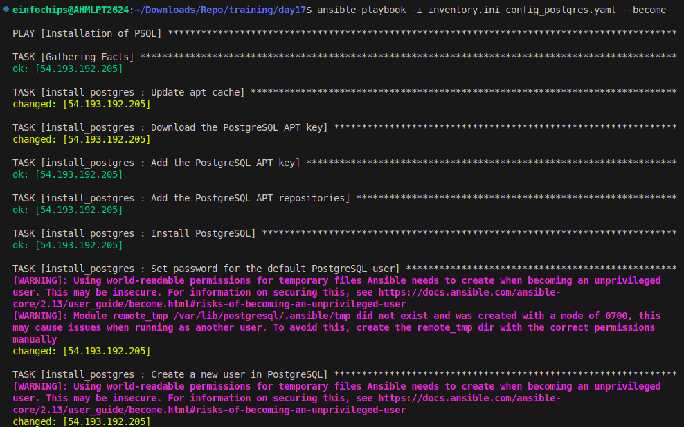
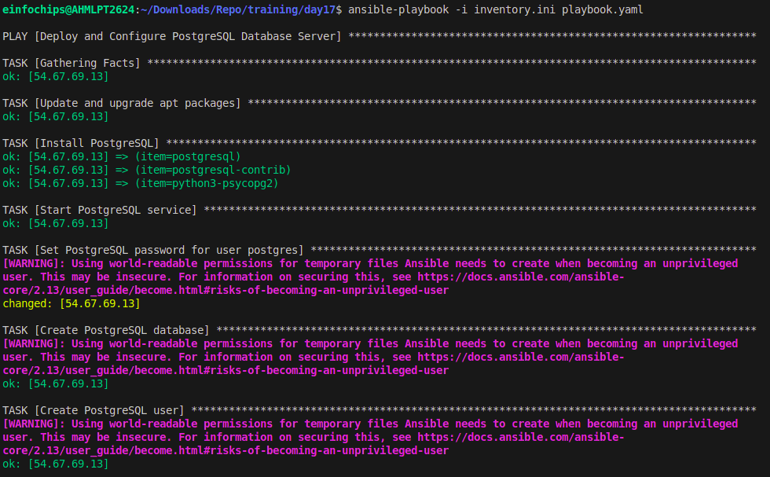
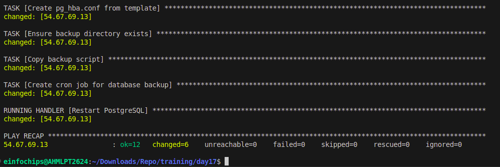

# Project 01: Deploy a Database Server with Backup Automation

## Objective

Automate the deployment, configuration, and backup of a PostgreSQL database server on an Ubuntu instance hosted on AWS using Ansible.

## Problem Statement

The goal is to automate the following tasks:
1. Deploy and configure a PostgreSQL database server on an AWS Ubuntu instance.
2. Create a database and a user with specific permissions.
3. Set up a cron job for regular database backups and ensure that backups are stored in a specified directory.
4. Use Ansible for configuration management, including handling sensitive data like database passwords.

## Requirements

1. **AWS Ubuntu Instance:** An Ubuntu server instance running on AWS.
2. **Database Server Deployment:** Deploy and configure PostgreSQL on the Ubuntu instance.
3. **Database Initialization:** Create a database and a user with specific permissions.
4. **Backup Automation:** Set up a cron job for regular database backups.
5. **Configuration Management:** Use Ansible to handle deployment and configuration.

## Deliverables

### 1. Ansible Inventory File

**Filename:** `inventory.ini`

**Content:** Defines the AWS Ubuntu instance and connection details for Ansible.

```ini
[db_server]
<AWS_PUBLIC_IP> ansible_user=ubuntu ansible_ssh_private_key_file=<private_key_file_path>
```

### 2. Ansible Playbook

**Filename:** `deploy_database.yml`

**Content:** Automates the installation of PostgreSQL, sets up the database, creates a user, and configures a cron job for backups. It also includes variables for database configuration and backup settings.

```yaml
---
- name: Deploy and Configure PostgreSQL Database Server
  hosts: db_server
  become: yes
  vars:
    postgres_user: shiv
    postgres_password: pass@123
    postgres_db: my_db
    backup_dir: /var/backups/postgresql
    pkg:
      - postgresql
      - postgresql-contrib
      - python3-psycopg2

  tasks:
    - name: Update and upgrade apt packages
      apt:
        update_cache: yes
        upgrade: dist

    - name: Install PostgreSQL
      apt:
        name: "{{ item }}"
        state: present
      loop: "{{ pkg }}"

    - name: Start PostgreSQL service
      service:
        name: postgresql
        state: started
        enabled: yes

    - name: Set PostgreSQL password for user postgres
      become_user: postgres
      shell: psql -c "ALTER USER postgres PASSWORD '{{ postgres_password }}';"

    - name: Create PostgreSQL database
      become_user: postgres
      postgresql_db:
        name: "{{ postgres_db }}"

    - name: Create PostgreSQL user
      become_user: postgres
      postgresql_user:
        db: "{{ postgres_db }}"
        name: "{{ postgres_user }}"
        password: "{{ postgres_password }}"
        priv: "ALL"

    - name: Create pg_hba.conf from template
      template:
        src: pg_hba.conf.j2
        dest: /etc/postgresql/16/main/pg_hba.conf
        mode: '0644'
        owner: postgres
        group: postgres
      notify:
        - Restart PostgreSQL

    - name: Ensure backup directory exists
      file:
        path: "{{ backup_dir }}"
        state: directory
        owner: postgres
        group: postgres
        mode: '0755'

    - name: Copy backup script
      copy:
        src: script.sh
        dest: /usr/local/bin/backup.sh
        mode: '0755'
        owner: postgres
        group: postgres

    - name: Create cron job for database backup
      cron:
        name: "PostgreSQL Backup"
        minute: "0"
        hour: "2"
        job: "/usr/local/bin/backup.sh > /dev/null 2>&1"
        user: postgres

  handlers:
    - name: Restart PostgreSQL
      service:
        name: postgresql
        state: restarted
```




### 4. Backup Script

**Filename:** `scripts/backup.sh`

**Content:** A script to perform the backup of the PostgreSQL database. This script should be referenced in the cron job defined in the playbook.

```bash
#!/bin/bash

# Variables
BACKUP_DIR="/var/backups/postgresql"
DATE=$(date +"%d-%m-%Y")
BACKUP_FILE="$BACKUP_DIR/db_backup_$DATE.sql"

# Perform backup
sudo -u postgres pg_dumpall > $BACKUP_FILE
```

## Usage Instructions

### Prerequisites

1. Ensure you have an AWS Ubuntu instance running.
2. Install Ansible on your local machine.
3. Ensure you have SSH access to the AWS instance.

### Steps

1. **Clone the repository:**

   ```bash
   git clone <repository_url>
   cd <repository_directory>
   ```

2. **Update the Inventory File:**

   - Open `inventory.ini` and update the AWS instance details.

3. **Update the Ansible Playbook:**

   - Open `deploy_database.yml` and update the variables (`postgres_user`, `postgres_password`, `postgres_db`, `backup_dir`) as needed.

4. **Run the Ansible Playbook:**

   ```bash
   ansible-playbook -i inventory.ini deploy_database.yml
   ```

5. **Verify the Setup:**

   - Check the PostgreSQL installation and database setup.
   - Ensure the backup script is in place and the cron job is configured.

## Conclusion

This README provides a comprehensive guide to automating the deployment, configuration, and backup of a PostgreSQL database server on an AWS Ubuntu instance using Ansible. By following the steps outlined, you can ensure a smooth and efficient setup process.


