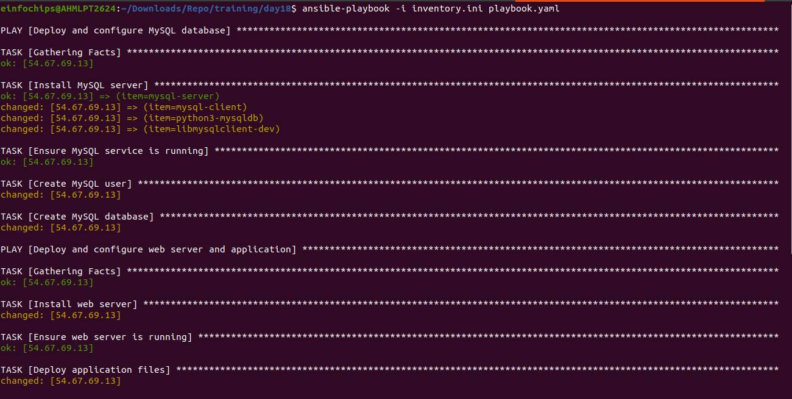
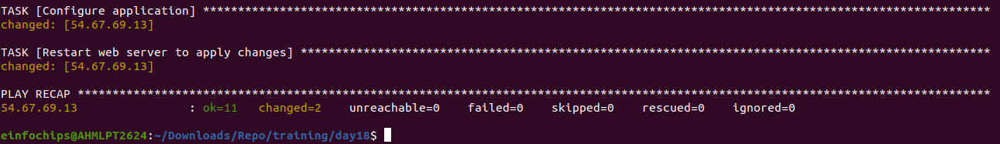

# Project 02: Automate the Setup of a Multi-Tier Web Application Stack

## Objective

Automate the deployment and configuration of a multi-tier web application stack using Ansible. This includes setting up separate database and application servers and ensuring the application is deployed and configured to connect to the database.

## Problem Statement

The goal is to automate the following tasks:
1. Set up a PostgreSQL database server on one Ubuntu instance.
2. Set up a web server (e.g., Apache or Nginx) on another Ubuntu instance to host a web application.
3. Ensure the web application is deployed on the application server and is configured to connect to the PostgreSQL database on the database server.
4. Use Ansible to automate the configuration of both servers, including the initialization of the database and the deployment of the web application.

## Deliverables

### 1. Ansible Inventory File

**Filename:** `inventory.ini`

**Content:** Defines the database server and application server instances, including their IP addresses and connection details.

```ini
[db_server]
db ansible_host=<DB_SERVER_IP> ansible_user=ubuntu ansible_ssh_private_key_file=/path/to/private/key

[app_server]
app ansible_host=<APP_SERVER_IP> ansible_user=ubuntu ansible_ssh_private_key_file=/path/to/private/key
```

### 2. Ansible Playbook

**Filename:** `playbook.yml`

**Content:** Automates the deployment and configuration of the PostgreSQL database server, the setup and configuration of the web server, and the deployment of the web application with its configuration to connect to the database.

```yaml
- name: Deploy and configure MySQL database
  hosts: db_server
  become: yes
  vars:
    db_name: "my_database"
    db_user: "my_user"
    db_password: "user123"

  tasks:
  - name: Install MySQL server
    apt:
      update_cache: yes
      name: "{{ item }}"
      state: present
    with_items:
    - mysql-server
    - mysql-client
    - python3-mysqldb
    - libmysqlclient-dev

  - name: Ensure MySQL service is running
    service:
      name: mysql
      state: started
      enabled: yes

  - name: Create MySQL user
    mysql_user:
      name: "{{ db_user }}"
      password: "{{ db_password }}"
      priv: '*.*:ALL'
      host: '%'
      state: present

  - name: Create MySQL database
    mysql_db:
      name: "{{ db_name }}"
      state: present

- name: Deploy and configure web server and application
  hosts: app_server
  become: yes

  vars:
    db_host: "host_ip"
    db_name: "my_database"
    db_user: "my_user"
    db_password: "user123"

  tasks:
  - name: Install web server
    apt:
      name: nginx
      state: present
      update_cache: yes

  - name: Ensure web server is running
    service:
      name: nginx
      state: started
      enabled: yes

  - name: Deploy application files
    copy:
      src: index.html
      dest: /var/www/html/index.html

  - name: Configure application
    template:
      src: app_config.php.j2
      dest: /var/www/html/app_config.php

  - name: Restart web server to apply changes
    service:
      name: nginx
      state: restarted
```




### 3. Jinja2 Template

**Filename:** `templates/app_config.php.j2`

**Content:** Defines a configuration file for the web application that includes placeholders for dynamic values such as database connection details.

```jinja2
<?php
$host = "{{ db_host }}";
$db = "{{ db_name }}";
$user = "{{ db_user }}";
$pass = "{{ db_password }}";

try {
    $pdo = new PDO("pgsql:host=$host;dbname=$db", $user, $pass);
    $pdo->setAttribute(PDO::ATTR_ERRMODE, PDO::ERRMODE_EXCEPTION);
} catch (PDOException $e) {
    echo 'Connection failed: ' . $e->getMessage();
}
?>
```

### 4. Application Files

**Filename:** `files/index.html`

**Content:** Static or basic dynamic content served by the web application.

```html
<!DOCTYPE html>
<html>
<head>
    <title>Welcome to Our Web Application</title>
</head>
<body>
    <h1>Welcome to Our Web Application</h1>
    <p>This is the homepage of our multi-tier web application.</p>
</body>
</html>
```

## Usage Instructions

### Prerequisites

1. Ensure you have two Ubuntu instances running on AWS.
2. Install Ansible on your local machine.
3. Ensure you have SSH access to the AWS instances.

### Steps

1. **Clone the repository:**

   ```bash
   git clone <repository_url>
   cd <repository_directory>
   ```

2. **Update the Inventory File:**

   - Open `inventory.ini` and update the IP addresses and connection details of the database and application servers.

3. **Update the Ansible Playbook:**

   - Open `deploy_multitier_stack.yml` and update the variables (`db_name`, `db_user`, `postgres_db`, `db_password`) as needed.

4. **Run the Ansible Playbook:**

   ```bash
   ansible-playbook -i inventory.ini deploy_multitier_stack.yml
   ```

5. **Verify the Setup:**

   - Check the PostgreSQL installation and database setup on the database server.
   - Ensure the web application is deployed and accessible on the application server.

## Conclusion

This README provides a comprehensive guide to automating the setup of a multi-tier web application stack using Ansible. By following the steps outlined, you can ensure a smooth and efficient deployment process for both the database and application servers.