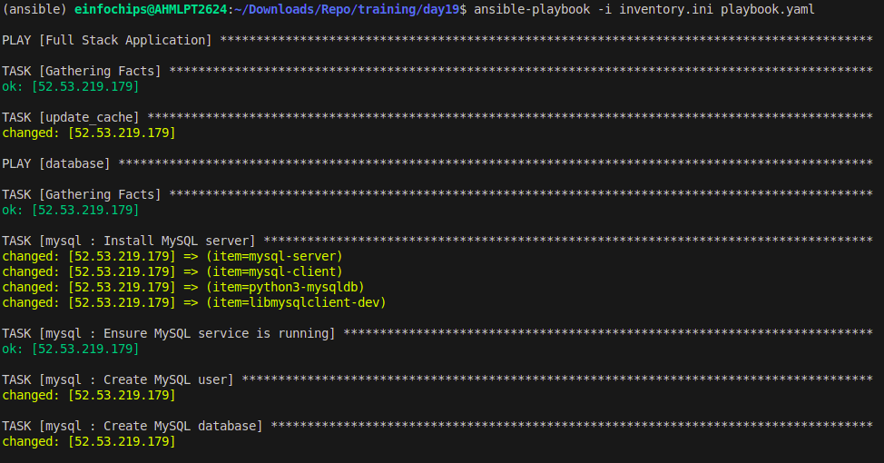
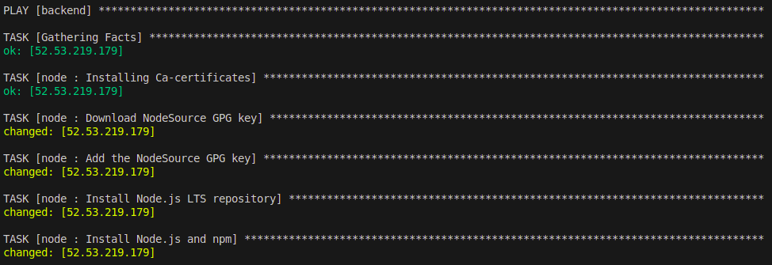
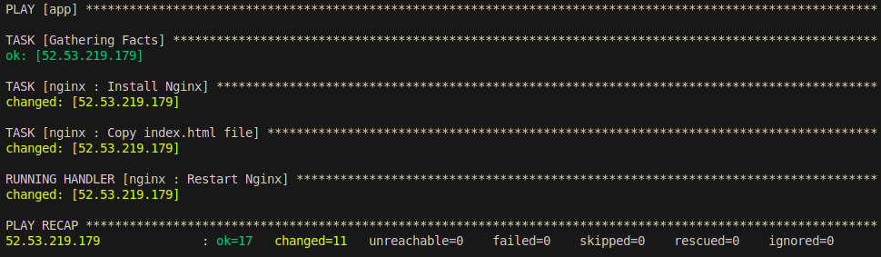

# Project 01: Deploying a Three-Tier Web Application with Ansible

## Problem Statement

You are tasked with deploying a three-tier web application (frontend, backend, and database) using Ansible roles. The frontend is an Nginx web server, the backend is a Node.js application, and the database is a MySQL server. Your solution should use Ansible Galaxy roles where applicable and define appropriate role dependencies. The deployment should be automated to ensure that all components are configured correctly and can communicate with each other.

## Steps and Deliverables

### 1. Define Project Structure

Create a new Ansible project with a suitable directory structure to organize roles, playbooks, and inventory files.

### 2. Role Selection and Creation

- **Select appropriate roles from Ansible Galaxy for each tier of the application:**
  - Nginx for the frontend.
  - Node.js for the backend.
  - MySQL for the database.
- **Create any custom roles** needed for specific configurations that are not covered by the Galaxy roles.

### 3. Dependencies Management

- **Define dependencies for each role** in the `meta/main.yml` file.
- **Ensure that the roles have appropriate dependencies**, such as ensuring the database is set up before deploying the backend.

### 4. Inventory Configuration

- **Create an inventory file** that defines the groups of hosts for each tier (frontend, backend, database).
- **Ensure proper group definitions and host variables** as needed.

### 5. Playbook Creation

- **Create a playbook (`deploy.yml`)** that includes and orchestrates the roles for deploying the application.
- **Ensure the playbook handles the deployment order** and variable passing between roles.

### 6. Role Customization and Variable Definition

- **Customize the roles by defining the necessary variables** in `group_vars` or `host_vars` as needed for the environment.
- **Ensure sensitive data like database credentials are managed securely.**

### 7. Testing and Validation

- **Create a separate playbook (`test.yml`)** for testing the deployment that verifies each tier is functioning correctly and can communicate with the other tiers.
- **Use Ansible modules and tasks** to check the status of services and applications.

### 8. Documentation

- **Document the setup process**, including any prerequisites, role dependencies, and how to run the playbooks.
- **Include a README.md file** that provides an overview of the project and instructions for use.

## Deliverables

### 1. Ansible Project Directory Structure

Organized directory structure with roles, playbooks, inventory, and configuration files.

```
ansible_project/
├── inventory.ini
├── group_vars/
├── roles/
│   ├── mysql/
│   ├── nginx/
│   └── node/
├── templates/
├── files/
├── deploy.yml
└── test.yml
```

### 2. Inventory File

Inventory file defining groups and hosts for frontend, backend, and database tiers.

Example `inventory/production.ini`:

```ini
[app]
<FRONTEND_SERVER_IP> ansible_user=ubuntu ansible_ssh_private_key_file=~/.ssh/aws_key.pem

[backend]
<BACKEND_SERVER_IP> ansible_user=ubuntu ansible_ssh_private_key_file=~/.ssh/aws_key.pem

[database]
<DATABASE_SERVER_IP> ansible_user=ubuntu ansible_ssh_private_key_file=~/.ssh/aws_key.pem
```

### 3. Playbook for Deployment (`deploy.yml`)

Playbook that orchestrates the deployment of the three-tier application.

Example `deploy.yml`:

```yaml
---
- name: Deploy Three-Tier Web Application
  hosts: all
  become: yes
  roles:
    - database
    - backend
    - frontend
```

### 4. Playbook for Testing (`test.yml`)

Playbook that verifies the deployment and functionality of each tier.

Example `test.yml`:

```yaml
---
- name: Full Stack Application
  hosts: all
  become: yes
  tasks:
    - name: update_cache
      apt:
        update_cache: yes

- hosts: database
  become: true
  roles: 
    - mysql

- hosts: backend
  become: true
  roles: 
    - node

- hosts: app
  become: true
  roles: 
    - nginx
```





## Usage Instructions

### Prerequisites

1. Ensure you have three Ubuntu instances running (frontend, backend, and database).
2. Install Ansible on your local machine.
3. Ensure you have SSH access to the instances.

### Steps

1. **Clone the repository:**

   ```bash
   git clone <repository_url>
   cd ansible_project
   ```

2. **Update the Inventory File:**

   - Open `inventory.ini` and update the IP addresses and connection details of the servers.

3. **Update the Variables:**

   - Open the appropriate files to update the variables such as database credentials.

4. **Run the Deployment Playbook:**

   ```bash
   ansible-playbook -i inventory.ini deploy.yml
   ```

5. **Run the Test Playbook:**

   ```bash
   ansible-playbook -i inventory.ini test.yml
   ```

## Conclusion

This README provides a comprehensive guide to deploying a three-tier web application using Ansible roles. By following the steps outlined, you can ensure a smooth and automated deployment process for the frontend, backend, and database servers.