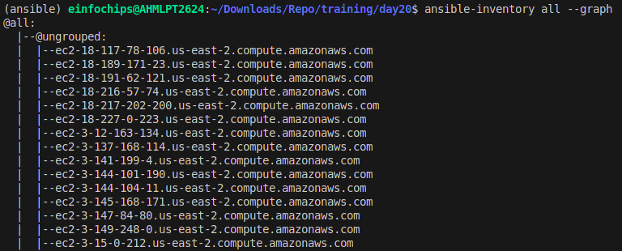

# Project : Dynamic Inventory and Web Application Deployment with Ansible

## Problem Statement

In this capstone project, you will create a comprehensive automated deployment pipeline for a web application on an AWS EC2 instance running Ubuntu using Ansible. You will follow best practices for playbooks and roles, implement version control, document and maintain your code, break down tasks into roles, write reusable and maintainable code, and use dynamic inventory scripts. This project will culminate in a fully functional deployment, demonstrating your mastery of Ansible for infrastructure automation.

Sure, here's the updated README with Milestones 3, 4, and 5 included:

---

## Milestone 1: Environment Setup

### Objective
Configure your development environment and AWS infrastructure.

### Tasks

1. **Launch an AWS EC2 instance running Ubuntu**
   - Log in to your AWS Management Console.
   - Navigate to the EC2 Dashboard.
   - Click on "Launch Instance."
   - Choose the Ubuntu Server AMI.
   - Select an instance type (e.g., t2.micro for free tier eligibility).
   - Configure instance details as needed.
   - Add storage (default 8 GB is usually sufficient).
   - Configure security group to allow SSH access (port 22).
   - Review and launch the instance.
   - Download the key pair (.pem file) for SSH access.

2. **Install Ansible and Git on your local machine or control node**
   - **On Ubuntu/Debian**:
     ```sh
     sudo apt update
     sudo apt install ansible git -y
     ```
   - **On CentOS/RHEL**:
     ```sh
     sudo yum install epel-release -y
     sudo yum install ansible git -y
     ```
   - **On macOS (using Homebrew)**:
     ```sh
     brew install ansible git
     ```

### Deliverables

- **AWS EC2 instance running Ubuntu**
  - Verify the instance is up and running by connecting via SSH:
    ```sh
    ssh -i /path/to/your-key-pair.pem ubuntu@your-ec2-instance-public-dns
    ```

- **Local or remote control node with Ansible and Git installed**
  - Verify the installations:
    ```sh
    ansible --version
    git --version
    ```

---

## Milestone 2: Create Ansible Role Structure

### Objective
Organize your Ansible project using best practices for playbooks and roles.

### Tasks

1. **Use Ansible Galaxy to create roles for web server, database, and application deployment**
   - Create a project directory:
     ```sh
     mkdir my-ansible-project
     cd my-ansible-project
     ```
   - Use Ansible Galaxy to create roles:
     ```sh
     ansible-galaxy init roles/nginx
     ansible-galaxy init roles/mysql
     ansible-galaxy init roles/node
     ```

2. **Define the directory structure and initialize each role**
   - The directory structure should look like this:
     ```
     my-ansible-project/
     ├── roles/
     │   ├── nginx/
     │   │   ├── defaults/
     │   │   ├── files/
     │   │   ├── handlers/
     │   │   ├── meta/
     │   │   ├── tasks/
     │   │   ├── templates/
     │   │   ├── tests/
     │   │   └── vars/
     │   ├── mysql/
     │   │   ├── defaults/
     │   │   ├── files/
     │   │   ├── handlers/
     │   │   ├── meta/
     │   │   ├── tasks/
     │   │   ├── templates/
     │   │   ├── tests/
     │   │   └── vars/
     │   └── node/
     │       ├── defaults/
     │       ├── files/
     │       ├── handlers/
     │       ├── meta/
     │       ├── tasks/
     │       ├── templates/
     │       ├── tests/
     │       └── vars/
     ├── playbooks.yaml
     └── ansible.cfg
     ```

### Deliverables

- **Ansible role directories for webserver, database, and application**
  - Verify the directory structure:
    ```sh
    tree my-ansible-project
    ```

---

## Milestone 3: Version Control with Git

### Objective
Implement version control for your Ansible project.

### Tasks

1. **Initialize a Git repository in your project directory**
   - Navigate to your project directory:
     ```sh
     cd my-ansible-project
     ```
   - Initialize a Git repository:
     ```sh
     git init
     ```

2. **Create a .gitignore file to exclude unnecessary files**
   - Create a `.gitignore` file and add common Ansible and system files to ignore:
     ```sh
     touch .gitignore
     echo "*.pem" >> .gitignore
     ```

3. **Commit and push the initial codebase to a remote repository**
   - Add your files to the repository:
     ```sh
     git add .
     git commit -m "Initial commit of Ansible project"
     ```
   - Push the code to a remote repository (e.g., GitHub):
     ```sh
     git remote add origin https://github.com/yourusername/your-repo-name.git
     git push -u origin master
     ```

### Deliverables

- **Git repository with initial Ansible codebase**
  - Verify the repository is correctly initialized and pushed:
    ```sh
    git status
    git log
    ```

- **Remote repository link (e.g., GitHub)**
  - The URL of your remote repository:
    ```
    https://github.com/yourusername/your-repo-name
    ```

---

## Milestone 4: Develop Ansible Roles

### Objective
Write Ansible roles for web server, database, and application deployment.

### Tasks

1. **Define tasks, handlers, files, templates, and variables within each role**
   - Populate each role directory (`tasks`, `handlers`, `files`, `templates`, `vars`) with the necessary Ansible code.

2. **Ensure each role is modular and reusable**
   - Use variables and handlers to make roles flexible and reusable across different projects.

### Deliverables

- **Completed Ansible roles for webserver, database, and application**
  - Verify each role by running the playbook and checking for successful execution:
    ```sh
    ansible-playbook playbooks.yaml
    ```

---

## Milestone 5: Documentation and Maintenance

### Objective
Document your Ansible roles and playbooks for future maintenance.

### Tasks

1. **Create README.md files for each role explaining purpose, variables, tasks, and handlers**
   - Create a `README.md` in main directory with detailed explanations:
     ```sh
     touch README.md
     ```

2. **Add comments within your playbooks and roles to explain complex logic**
   - Ensure all complex tasks and logic are well-documented with comments in the code.

### Deliverables

- **README.md files for webserver, database, and application roles**
  - Verify the existence and content of the README files:
    ```sh
    cat README.md
    ```

- **Well-documented playbooks and roles**
  - Review the playbooks and roles to ensure they contain sufficient comments and documentation.

---

This README now includes detailed steps and deliverables for Milestones 1 through 5, guiding you through the setup, organization, version control, development, and documentation of your Ansible project.

## Milestone 6: Dynamic Inventory Script

### Objective

Use dynamic inventory scripts to manage AWS EC2 instances.

### Tasks

1. **Write a Python script** that queries AWS to get the list of EC2 instances.
2. **Format the output** as an Ansible inventory.

### Deliverables

- **Dynamic inventory script** to fetch EC2 instance details.

### Steps to Create the Dynamic Inventory Script

1. **Install AWS CLI and Boto3**:
   Ensure you have the AWS CLI and Boto3 installed on your local machine.

   ```bash
   pip install awscli boto3
   ```

2. **Configure AWS CLI**:
   Configure the AWS CLI with your credentials.

   ```bash
   aws configure
   ```

3. **Write the Python Script**:
   Create a script named `dynamic_inventory.py`.

   ```python
   # ec2_inventory.py
   #!/usr/bin/env python

    import json
    import boto3

    def get_inventory():
        ec2 = boto3.client('ec2', region_name='us-east-2')  # Specify your region
        response = ec2.describe_instances(Filters=[{'Name': 'tag:Role', 'Values': ['webserver']}])
        
        inventory = {
            'all': {
                'hosts': [],
                'vars': {}
            },
            '_meta': {
                'hostvars': {}
            }
        }
        
        ssh_key_file = 'ansible-worker.pem'  # Path to your SSH private key file
        ssh_user = 'ubuntu'  # SSH username
        
        for reservation in response['Reservations']:
            for instance in reservation['Instances']:
                public_dns = instance.get('PublicDnsName', instance['InstanceId'])
                inventory['all']['hosts'].append(public_dns)
                inventory['_meta']['hostvars'][public_dns] = {
                    'ansible_host': instance.get('PublicIpAddress', instance['InstanceId']),
                    'ansible_ssh_private_key_file': ssh_key_file,
                    'ansible_user': ssh_user
                }

        return inventory

    if __name__ == '__main__':
        print(json.dumps(get_inventory()))

   ```

4. **Make the Script Executable**:

   ```bash
   chmod +x dynamic_inventory.py
   ```

5. **Test the Script**:

  ```bash
    ansible all --list
  ```
  
  ```bash
   ansible-inventory all --graph
   ```
  

   The output should be a JSON formatted inventory of your running EC2 instances.

## Milestone 7: Playbook Development and Deployment

### Objective

Create and execute an Ansible playbook to deploy the web application.

### Tasks

1. **Develop a master playbook** that includes all roles.
2. **Define inventory and variable files** for different environments.
3. **Execute the playbook** to deploy the web application on the EC2 instance.

### Deliverables

- **Ansible playbook** for web application deployment.
- **Successfully deployed web application** on the EC2 instance.

### Steps to Develop and Deploy the Playbook

1. **Project Structure**:

   ```bash
   ansible_project/
   ├── inventory/
   │   ├── production.ini
   ├── group_vars/
   │   ├── all.yml
   ├── roles/
   │   ├── webserver/
   │   ├── application/
   │   └── database/
   ├── playbook.yml
   └── dynamic_inventory.py
   ```

2. **Define Inventory and Variables**:

   - **Inventory**: Use the dynamic inventory script.

     ```bash
     ansible-playbook -i ec2_inventory.py playbook.yml
     ```

3. **Develop the Master Playbook**:

   ```yaml
   # playbook.yml
   ---
   - name: Deploy Web Application
     hosts: all
     become: yes
     roles:
       - role: database
       - role: application
       - role: webserver
   ```

4. **Roles**:
   - **Database Role**: `roles/mysql`
   - **Application Role**: `roles/node`
   - **Webserver Role**: `roles/nginx`

5. **Execute the Playbook**:

   ```bash
   ansible-playbook -i ec2_inventory.py playbook.yml
   ```

   This command will use the dynamic inventory to get the list of EC2 instances and deploy the web application on them.