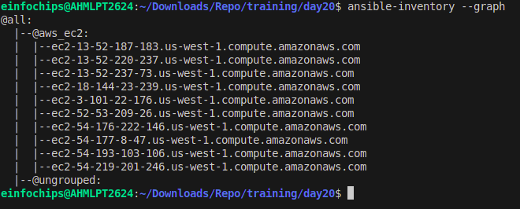

# Project 01

### Inventory Plugins

#### Activity
Configure a dynamic inventory plugin to manage a growing number of web servers dynamically. Integrate the plugin with Ansible to automatically detect and configure servers in various environments.

#### Tasks
1. **Configure a Dynamic Inventory Plugin**
   - Use a dynamic inventory plugin to automatically discover and manage servers.
   - Integrate the dynamic inventory plugin with Ansible.

2. **Create a Dynamic Inventory Configuration File or Script**
   - Write a script or configuration file for the dynamic inventory plugin.

#### Deliverable
- **Dynamic inventory configuration file or script**
  - Demonstrate the ability to automatically update the inventory based on real-time server data.

---

### Performance Tuning

#### Activity
Tune Ansible performance by adjusting settings such as parallel execution (forks), optimizing playbook tasks, and reducing playbook run time.

#### Tasks
1. **Adjust Parallel Execution Settings**
   - Modify the `forks` setting in `ansible.cfg` to optimize parallel execution.

2. **Optimize Playbook Tasks**
   - Review and optimize playbook tasks for improved performance.

3. **Reduce Playbook Run Time**
   - Implement changes to minimize the total execution time of playbooks.

#### Deliverable
- **Optimized `ansible.cfg` configuration file**
  - Performance benchmarks and documentation detailing changes made for performance improvement.

---

### Debugging and Troubleshooting Playbooks

#### Activity
Implement debugging strategies to identify and resolve issues in playbooks, including setting up verbose output and advanced error handling.

#### Tasks
1. **Enable Verbose Output**
   - Configure Ansible to provide detailed output during playbook execution.

2. **Implement Advanced Error Handling**
   - Enhance playbooks with improved error handling mechanisms.

3. **Create a Troubleshooting Guide**
   - Document common issues and their solutions in a troubleshooting guide.

#### Deliverable
- **Debugged playbooks with enhanced error handling and logging**
  - A troubleshooting guide with common issues and solutions.

---

### Exploring Advanced Modules

#### Activity
Use advanced Ansible modules such as `docker_container` to manage containerized applications and `aws_ec2` for AWS infrastructure management, demonstrating their integration and usage.

#### Tasks
1. **Deploy and Manage Docker Containers**
   - Create playbooks using the `docker_container` module to manage containerized applications.

2. **Manage AWS EC2 Instances**
   - Use the `aws_ec2` module to manage AWS EC2 instances.

3. **Document Benefits and Configurations**
   - Provide documentation on the benefits and configurations of these advanced modules.

#### Deliverable
- **Playbooks showcasing the deployment and management of Docker containers and AWS EC2 instances**
  - Documentation on the benefits and configurations of these advanced modules.

---

## Inventory Setup

### Dynamic Inventory Configuration

1. **Create the Inventory Directory**
   - Create a directory for the inventory:
     ```sh
     mkdir day20
     ```

2. **Create a Dynamic Inventory Script**
   - Write a script to dynamically generate the inventory. For example, a script to pull data from AWS:
     ```sh
     touch day20/aws_ec2.yml
     ```

     Example `aws_ec2.yml`:
     ```yaml
     plugin: aws_ec2
     regions:
       - us-east-1
     filters:
       instance-state-name: running
     keyed_groups:
       - key: tags.Name
         prefix: name_
       - key: tags.Environment
         prefix: env_
     ```
     

3. **Configure the Inventory Plugin in `ansible.cfg`**
   - Update the `ansible.cfg` file to use the dynamic inventory:
     ```ini
     [defaults]
     inventory = path/to/inventory/file
     enable_plugins = script, aws_ec2
     host_key_checking = False
     remote_user = ubuntu
     private_key_file = path/to/private/key
     ```

### Optimized `ansible.cfg` Configuration

1. **Adjust Parallel Execution Settings**
   - Modify the `forks` setting for better performance:
     ```ini
     [defaults]
     forks = 20
     ```

2. **Additional Performance Optimizations**
   - Add other performance-related settings:
     ```ini
     [defaults]
     timeout = 30
     retries = 3

     [ssh_connection]
     pipelining = True
     ```

### Debugging and Troubleshooting

1. **Enable Verbose Output**
   - Use the `-v` options to increase verbosity:
     ```sh
     ansible-playbook playbooks/site.yml -vvv
     ```

2. **Implement Advanced Error Handling**
   - Add error handling in playbooks:
     ```yaml
     tasks:
       - name: Ensure Docker is running
         service:
           name: docker
           state: started
         register: docker_service
         failed_when: docker_service.state != 'started'
         ignore_errors: yes
     ```

     

3. **Create a Troubleshooting Guide**
   - Document common issues and solutions:
     ```sh
     touch my-ansible-project/docs/troubleshooting.md
     ```

     Example `troubleshooting.md`:
     ```markdown
     # Troubleshooting Guide

     ## Common Issues

     ### Issue: Docker service not starting
     **Solution:**
     - Check the Docker logs for errors: `sudo journalctl -u docker`
     - Ensure the Docker service is enabled: `sudo systemctl enable docker`

     ### Issue: EC2 instance not reachable
     **Solution:**
     - Verify the security group settings in AWS to allow SSH access.
     - Check the instance's public IP and DNS configuration.
     ```

### Advanced Modules Playbooks

1. **Deploy and Manage Docker Containers**
   - Create a playbook for Docker containers:
     ```sh
     touch my-ansible-project/playbooks/docker.yml
     ```

     Example `docker.yml`:
     ```yaml
     - hosts: all
       tasks:
         - name: Run a Docker container
           docker_container:
             name: my_app
             image: my_app_image
             state: started
             ports:
               - "81:80"
     ```
     

2. **Manage AWS EC2 Instances**
   - Create a playbook for AWS EC2 instances:
     ```sh
     touch my-ansible-project/playbooks/aws_ec2.yml
     ```

     Example `aws_ec2.yml`:
     ```yaml
     - hosts: localhost
       tasks:
         - name: Launch an EC2 instance
           aws_ec2:
             key_name: my_key
             instance_type: t2.micro
             image: ami-12345678
             wait: yes
             region: us-east-1
             count: 1
             vpc_subnet_id: subnet-12345678
             assign_public_ip: yes
             instance_tags:
               Name: my_ec2_instance
     ```

3. **Document Benefits and Configurations**
   - Provide documentation:
     ```sh
     touch my-ansible-project/docs/advanced_modules.md
     ```

     Example `advanced_modules.md`:
     ```markdown
     # Advanced Ansible Modules

     ## Docker Container Module

     **Benefits:**
     - Simplifies the management of containerized applications.
     - Integrates seamlessly with Docker ecosystem.

     **Configuration:**
     - Ensure Docker is installed on the target hosts.
     - Define container settings in the `docker_container` module.

     ## AWS EC2 Module

     **Benefits:**
     - Automates the provisioning and management of AWS infrastructure.
     - Provides comprehensive control over AWS EC2 instances.

     **Configuration:**
     - Set up AWS credentials and configure the `aws_ec2` module.
     - Define instance specifications and tags in the playbook.
     ```
