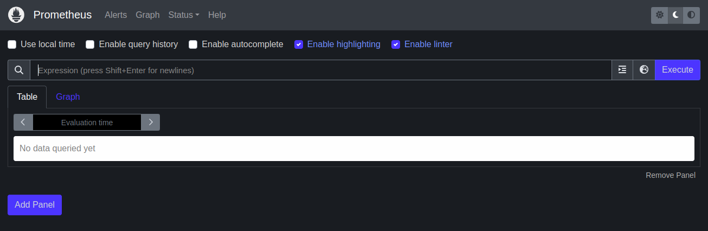
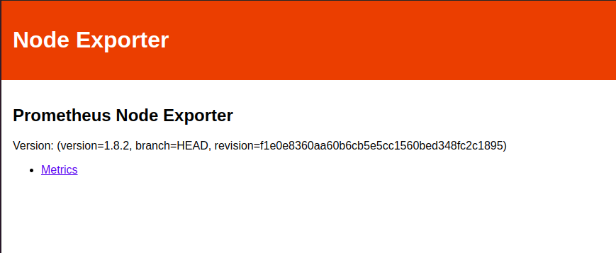
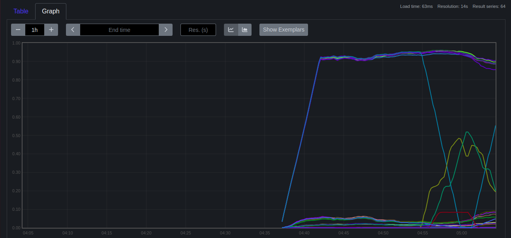
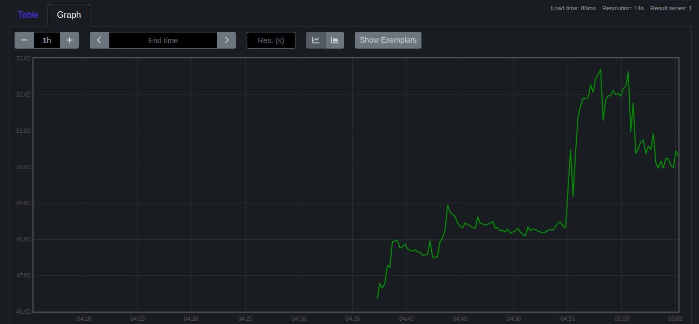

# Project :

### Project Overview:
+ The goal of this capstone project is to combine shell scripting with system monitoring and log management practices. You will create a set of automated tools using shell scripts to manage logs, monitor system performance using Prometheus and Node Exporter, and generate insights using PromQL queries. The project will require a systematic approach, covering scripting fundamentals, log management, and monitoring setup.

### Project Deliverables:
1. Shell Scripts for Basic Operations:
    + Task: Write shell scripts to perform basic system operations, such as checking disk usage, memory usage, and CPU load.

    + Deliverable:

        + A collection of scripts that output system performance metrics.

        + Scripts should include error handling and logging.

```sh
#!/bin/bash

REPORT_FILE="system_report_$(date +"%d-%m-%Y").log"
monitor_system_metrices() {
    echo "=== System Metrices ===" >> ${REPORT_FILE}
    echo "--- CPU and Memory Usage ---" >> ${REPORT_FILE}
    top -bn1 | grep "Cpu(s)" | cut -d "," -f4 | cut -d " " -f2 | awk '{print "CPU usage : " 100 - $1 "%"}' >> ${REPORT_FILE}
    free -m | grep "Mem" | awk '{print "Memory Usage : " $3/$2 * 100.0 "%"}' >> ${REPORT_FILE}
    echo "" >> ${REPORT_FILE}

    echo "--- Disk Usage ---" >> ${REPORT_FILE}
    df -h >> ${REPORT_FILE}
    echo "" >> ${REPORT_FILE}
}

monitor_system_metrices
```

<br>

2. Log Management Script:

    + Task: Develop a script to automate log management tasks such as log rotation and archiving. This script should include the ability to compress old logs and delete logs older than a specified number of days.

    + Deliverable:
        
        + A shell script that performs log rotation based on predefined conditions (e.g., log size, log age).
        + A report generated by the script detailing which logs were rotated, compressed, or deleted.

```sh
#!/bin/bash

# Set log directory and rotation settings
LOG_DIR=/var/log/myapp/
MAX_LOG_SIZE=100M
MAX_LOG_AGE=30

# Set compression tool and report file
COMPRESS_TOOL=gzip
REPORT_FILE=log_management_report.txt

# Function to rotate logs
rotate_logs() {
  for log in $(find $LOG_DIR -type f -size +$MAX_LOG_SIZE); do
    log_name=$(basename $log)
    log_dir=$(dirname $log)
    new_log_name=$log_dir/${log_name}.1
    mv $log $new_log_name
    echo "Rotated log: $log_name" >> $REPORT_FILE
  done
}

# Function to compress old logs
compress_logs() {
  for log in $(find $LOG_DIR -type f -name "*.1" -mtime +$MAX_LOG_AGE); do
    log_name=$(basename $log)
    log_dir=$(dirname $log)
    compressed_log_name=$log_dir/${log_name}.gz
    $COMPRESS_TOOL $log
    rm $log
    echo "Compressed log: $log_name" >> $REPORT_FILE
  done
}

# Function to delete old logs
delete_logs() {
  for log in $(find $LOG_DIR -type f -name "*.gz" -mtime +$MAX_LOG_AGE); do
    log_name=$(basename $log)
    rm $log
    echo "Deleted log: $log_name" >> $REPORT_FILE
  done
}

# Main script
echo "Log Management Report" > $REPORT_FILE
echo "---------------------" >> $REPORT_FILE
rotate_logs
compress_logs
delete_logs
echo "Log management tasks completed." >> $REPORT_FILE
```

3. Advanced Shell Scripting - Loops, Conditions, Functions, and Error Handling:

    + Task: Refactor the previous scripts to include loops, conditionals, and functions for modularity. Implement error handling to manage potential issues during script execution.
    
    + Deliverable:
        
        + Modular shell scripts that use functions for repeatable tasks.
        
        + Error-handling mechanisms in place for scenarios like missing files, insufficient permissions, etc.
        
        + Logs that track script execution and any errors encountered.

```sh
#!/bin/bash

LOG_DIR="/var/log/myapp"
ARCHIVE_DIR="/var/log/archive"
DAYS_TO_KEEP=30

# Error handling function
handle_error() {
  echo "Error on line $1"
  exit 1
}

# Trap errors
trap 'handle_error $LINENO' ERR

# Rotate and compress logs
rotate_logs() {
  for log_file in "$LOG_DIR"/*.log; do
    if [[ -f "$log_file" ]]; then
      gzip "$log_file"
      mv "$log_file.gz" "$ARCHIVE_DIR"
    fi
  done
}

# Delete old logs
delete_old_logs() {
  find "$ARCHIVE_DIR" -type f -name "*.gz" -mtime +$DAYS_TO_KEEP -delete
}

# Main function
main() {
  rotate_logs
  delete_old_logs
}

main 2>&1 | tee -a /var/log/myapp/myapp.log
```

+ As We have used all factor which was mentioned to this task in previous task itself so it will remain same in this.

4. Log Checking and Troubleshooting:

    + Task: Write a script that reads through system and application logs, identifies common issues (e.g., out of memory, failed service starts), and provides troubleshooting steps based on log analysis.

    + Deliverable:
        
        + A script that parses logs for errors or warnings and outputs possible root causes.
        + Documentation on the types of logs checked and the issues identified.        
        + A troubleshooting guide based on common errors found in the logs.

```sh
#!/bin/bash

LOG_FILE="/var/log/syslog"
KEYWORDS=("out of memory" "failed" "error" "panic")

# Parse logs for issues
parse_logs() {
  for keyword in "${KEYWORDS[@]}"; do
    echo "Searching for $keyword in logs..."
    grep -i "$keyword" "$LOG_FILE" >> /var/log/troubleshooting.log
  done
}

# Troubleshooting guide
generate_troubleshooting_guide() {
  echo "Troubleshooting Guide" > /var/log/troubleshooting_guide.txt
  echo "1. Out of memory: Check system resources and consider adding swap space." >> /var/log/troubleshooting_guide.txt
  echo "2. Failed service starts: Ensure the service configuration is correct and dependencies are met." >> /var/log/troubleshooting_guide.txt
  echo "3. General errors: Check the application configuration and logs for specific error messages." >> /var/log/troubleshooting_guide.txt
}

# Main function
main() {
  parse_logs
  generate_troubleshooting_guide
}

main 2>&1 | sudo tee -a /var/log/log_checking.log
```


5. Installation and Setup of Prometheus and Node Exporter:
    
    + Task: Install and configure Prometheus and Node Exporter on the system. Ensure that Node Exporter is properly configured to collect system metrics.
    
    + Deliverable:
        
        + A documented installation and configuration process for Prometheus and Node Exporter.
        
        + A running instance of Prometheus scraping metrics from Node Exporter.

### Steps to install Prometheus

+ First download the zip file from

```sh
wget https://github.com/prometheus/prometheus/releases/download/v2.53.1/prometheus-2.53.1.linux-amd64.tar.gz
```


+ then to unzip it run

```sh
tar -xvf prometheus-2.53.1.linux-amd64.tar.gz
```

+ Then change directory

```sh
cd prometheus-2.53.1.linux-amd64/
```

+ And try to run Prometheus

```sh
./prometheus 
```

## Output




### Steps to install Node-Exporter

+ First Download the Zip

```sh
wget https://github.com/prometheus/node_exporter/releases/download/v1.8.2/node_exporter-1.8.2.linux-amd64.tar.gz
```

+ Unzip the file using:

```sh
tar -xvf node_exporter-1.8.2.linux-amd64.tar.gz
```

+ Change the directory path

```sh
cd node_exporter-1.8.2.linux-amd64/
```

+ And try to run

```sh
./node_exporter 
```

## Output



6. Prometheus Query Language (PromQL) Basic Queries:
    
    + Task: Create a series of PromQL queries to monitor system performance, such as CPU usage, memory usage, and disk I/O.
    
    + Deliverable:
        
        + A set of PromQL queries that can be used to monitor key system metrics.
        
        + A dashboard setup guide or configuration that visualizes these metrics in Prometheus or Grafana.


+ add a sample node_exporter job

```yml
  # sample node_exporter job
  - job_name: "node"
    static_configs:
      - targets: ["localhost:9100"]
```

+ The Run the query

## Output

```
rate(node_cpu_seconds_total[5m])
```


```
100 - (node_memory_MemAvailable_bytes / node_memory_MemTotal_bytes * 100)
```
