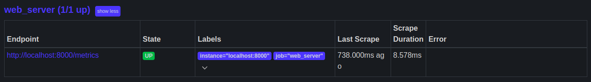
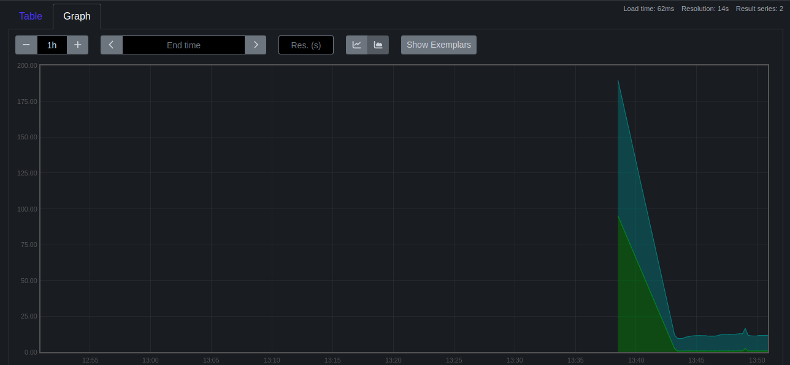
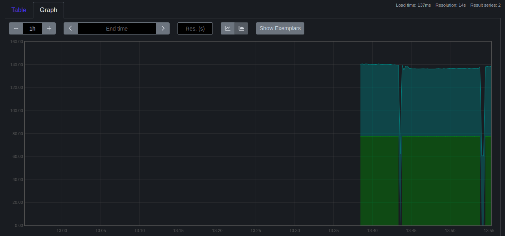
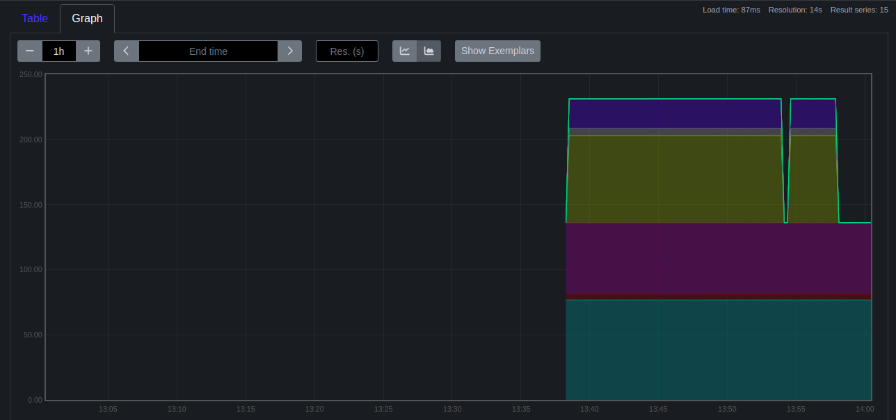
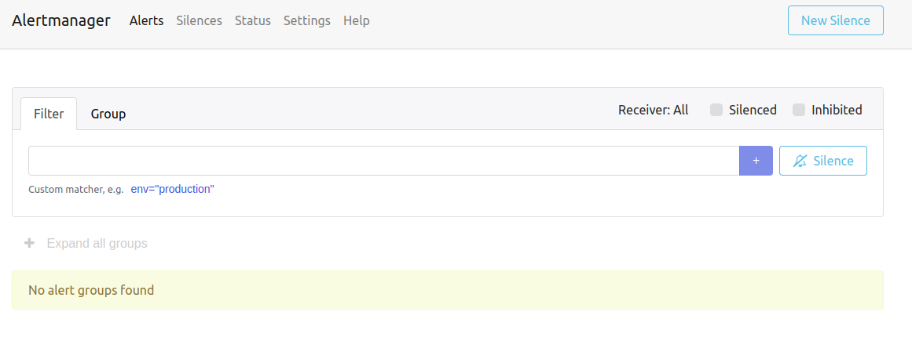
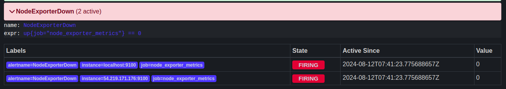
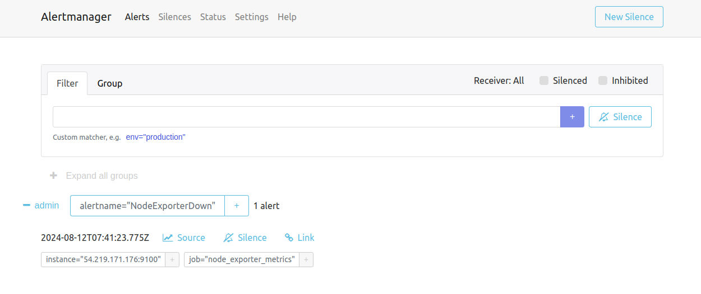
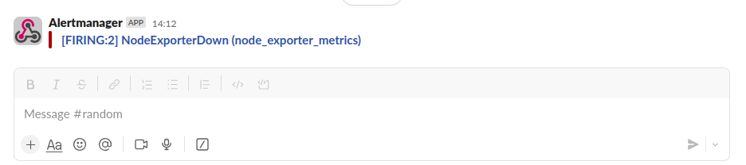

# Project :

## Project Breakdown

1. Configuring Jobs and Targets:
    
    + Task: Set up a Prometheus server to monitor multiple services running on different nodes.
    
    + Deliverable:
        
        + Configure Prometheus with jobs for monitoring different services like web servers, databases, and system metrics.
        
        + Define static and dynamic targets using file-based and service discovery methods (e.g., Consul or Kubernetes).

## Output



2. Using Exporters (Node Exporter):
    
    + Task: Use Node Exporter to monitor system-level metrics like CPU, memory, disk usage, and network statistics.
    
    + Deliverable:
        
        + Install and configure Node Exporter on all nodes.

        
        + Ensure Node Exporter metrics are being correctly scraped by Prometheus.


+ The Run the queries

```
100 - (avg by(instance) (rate(node_cpu_seconds_total{mode="idle"}[5m])) * 100)
```
## Output



```
100 - (node_memory_MemAvailable_bytes / node_memory_MemTotal_bytes * 100)
```
## Output


```
100 - (node_filesystem_avail_bytes / node_filesystem_size_bytes * 100)
```

## Output



3. Hands-on Exercise: Setting Up Exporters:
    
    + Task: Configure at least two different types of exporters (e.g., Node Exporter and MySQL Exporter) and integrate them with Prometheus.
    
    + Deliverable:
        
        + Demonstrate successful data collection from both exporters.
        
        + Create a basic Prometheus dashboard to visualize key metrics from these exporters.

+ The Run the queries

```
100 - (avg by(instance) (rate(node_cpu_seconds_total{mode="idle"}[5m])) * 100)
```
## Output


```
100 - (node_memory_MemAvailable_bytes / node_memory_MemTotal_bytes * 100)
```
## Output


```
100 - (node_filesystem_avail_bytes / node_filesystem_size_bytes * 100)
```

## Output


4. Introduction to PromQL:
    
    + Task: Learn and implement basic PromQL queries to extract meaningful data from the metrics collected.
    
    + Deliverable:
        
        + Write basic queries to retrieve metrics like average CPU usage, memory consumption, and disk I/O over time.

    + Queries
        + Query for CPU usage

        ```
        100 - (avg by(instance) (rate(node_cpu_seconds_total{mode="idle"}[5m])) * 100)
        ```
        + Query for Memory Consumption
        ```
        100 - (node_memory_MemAvailable_bytes / node_memory_MemTotal_bytes * 100)
        ```
5. Basic Queries (Selectors, Functions, Operators):
    
    + Task: Create PromQL queries using selectors, functions, and operators to filter and manipulate time-series data.
    
    + Deliverable:
        
        + Write PromQL queries to calculate the 95th percentile of CPU usage.
        + Use functions like rate(), increase(), and histogram_quantile() to perform more complex analysis.

    + Queries
        + Query for CPU usage

        ```
        100 - (avg by(instance) (rate(node_cpu_seconds_total{mode="idle"}[5m])) * 100)
        ```
        + Query for Memory Consumption
        ```
        100 - (node_memory_MemAvailable_bytes / node_memory_MemTotal_bytes * 100)
        ```
6. Advanced Queries and Aggregations:
    
    + Task: Perform advanced data aggregation using PromQL.
    
    + Deliverable:
        
        + Write queries to calculate the total memory usage across all nodes.
        + Aggregate data to find the maximum disk space usage among all nodes.  
7. Configuring Alertmanager:
    
    + Task: Set up Alertmanager to handle alerts generated by Prometheus.
    
    + Deliverable:
        
        + Configure Alertmanager with Prometheus.
        + Create routing rules to manage alert notifications based on severity and service type.
          ```yml
          alerting:
            alertmanagers:
                - static_configs:
                    - targets:
                    - localhost:9093
          ```
          

8. Writing Alerting Rules:
    
    + Task: Write custom alerting rules in Prometheus to trigger alerts based on specific conditions.
    
    + Deliverable:
        + Create alerting rules for high CPU usage, memory leaks, and disk space running low.
        + Ensure alerts are correctly generated and sent to Alertmanager.
          ```yml
          groups:
            - name: CPUAlerts
            rules:
            - alert: HighCPUUsage
                expr: sum(rate(node_cpu_seconds_total{mode!="idle"}[5m])) by (instance) > 0.9
                for: 5m
                labels:
                severity: critical
                annotations:
                summary: "High CPU usage on {{ $labels.instance }}"
                description: "CPU usage is above 90% for more than 5 minutes."

            - record: job:node_cpu_seconds:avg_idle
                expr: avg without(cpu)(rate(node_cpu_seconds_total{mode="idle"}[5m]))

            - alert: NodeExporterDown
                expr: up{job="node_exporter_metrics"} == 0 
          ```
          
          
9. Setting Up Notification Channels (Email, Slack, etc.):
    
    + Task: Integrate Alertmanager with multiple notification channels like Email and Slack.
    
    + Deliverable:
        + Set up Email notifications for critical alerts.
        + Integrate Slack for real-time alerts and notifications.
          ```yml
          receivers:
          - name: 'web.hook'
              webhook_configs:
              - url: 'http://127.0.0.1:5001/'
          - name: admin
              slack_configs:
              - channel: "#random"
              api_url: "https://hooks.slack.com/services/T06QREEBBK4/B07GAUNQEDS  uYlw3NbiTiBFve5F7efBkAeB"
          ```
          
10. Hands-on Exercise: Creating Alerts:
    
    + Task: Test the entire alerting pipeline by creating and triggering custom alerts.
    
    + Deliverable:
        + Simulate a scenario where a node exceeds 90% CPU usage and ensure alerts are triggered and sent to both Email and Slack.
        + Validate the alerts in both notification channels.
          ```yml
          groups:
            - name: example
            rules:
                - record: job:node_cpu_seconds:avg_idle
                expr: avg without(cpu)(rate(node_cpu_seconds_total{mode="idle"}[5m]))

                - alert: NodeExporterDown
                expr: up{job="node"} == 0 
          ```
          