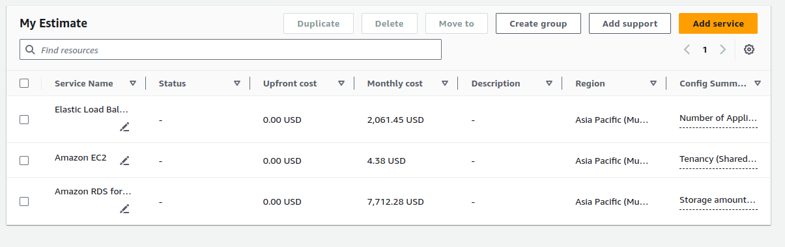

### Part 2: Estimating a Multi-Tier Architecture Solution

### Scenario:

```
You need to design and estimate the cost for a scalable web application that includes a load balancer, a set of EC2 instances for the application tier, and an RDS database for the data tier. The solution must support a user base of up to 100,000 concurrent users.
```

### Steps:

### 1. Define the Architecture:

+ Identify the components required: an Application Load Balancer, EC2 instances for the application servers, and an RDS instance for the database.
+ Consider the expected traffic and choose appropriate EC2 instance types and RDS configurations.

### 2.Select AWS Services:

+ Choose an Application Load Balancer to distribute incoming traffic.

+ Select EC2 instance types (e.g., t3.medium) that can handle the application load.

+ Choose an RDS instance type (e.g., db.m5.large) to support the database.

### 3. Estimate Costs Using AWS Pricing Calculator:

+ Navigate to the AWS Pricing Calculator.

+ Add the Application Load Balancer, EC2 instances, and RDS instance to the estimate.

+ Configure each service based on the expected load and required specifications (e.g., storage, data transfer).


### 4. Document and Analyze the Estimate:

+ Review the total estimated monthly cost.

+ Identify any areas where cost-saving measures could be applied (e.g., reserved instances, using Auto Scaling to optimize EC2 usage).

### 5. Prepare a Report:

+ Compile the architecture design and cost estimate into a report.

+ Provide recommendations on how to maintain performance while optimizing costs, considering the expected growth and scalability needs of the application.


## Output


