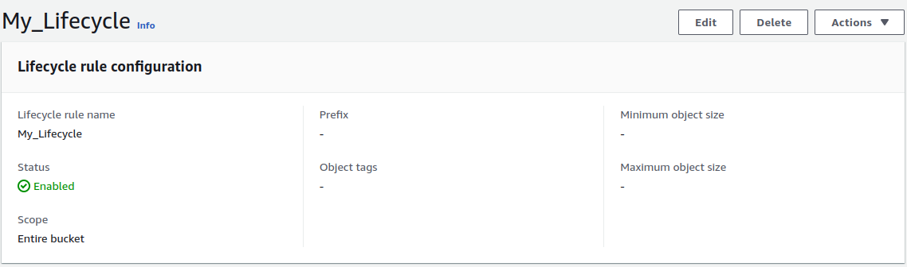

# Comprehensive AWS S3 Management and Static Website Hosting

## Objective

This project is designed to test and enhance your knowledge and skills in managing AWS S3 storage classes, lifecycle management, bucket policies, access control lists (ACLs), and hosting a static website on S3. The goal is to ensure that you have mastered the critical aspects of AWS S3 through practical application.

## Project Scenario

You are tasked with creating and managing an S3 bucket for a fictional company, **TechVista Inc.**, which hosts a static website to display their product portfolio. The website includes various types of content, such as high-resolution images/images, which require effective storage management to optimize costs. Additionally, the company mandates strict security requirements for accessing the content.

## Project Steps and Deliverables

### 1. Create and Configure an S3 Bucket
- **Create an S3 bucket** named `techvista-portfolio-[your-initials]`.
- **Enable versioning** on the bucket to maintain object versions.
- **Set up static website hosting** on the bucket.
- **Upload the provided static website files** (HTML, CSS, images/images).
- **Ensure accessibility** of the website via the S3 website URL.

`index.html` file
```html
<!DOCTYPE html>
<html lang="en">
<head>
    <meta charset="UTF-8">
    <meta name="viewport" content="width=device-width, initial-scale=1.0">
    <title>Document</title>
    <link rel="stylesheet" href="styles.css">
</head>
<body>
    <h1>Hello World!</h1>
    <h3>Welcome to My Custom webpage</h3>
    
</body>
</html>
```
`error.html` file
```html
<!DOCTYPE html>
<html lang="en">
<head>
    <meta charset="UTF-8">
    <meta name="viewport" content="width=device-width, initial-scale=1.0">
    <title>Document</title>
    <link rel="stylesheet" href="styles.css">
</head>
<body>
    <h1>404 Page Not Found</h1>
</body>
</html>
```
`styles.css` file
```css
body{
    display: flex;
    justify-content: center;
    align-items: center;
    margin: 0;
    flex-direction: column;
    text-align: center;
}
img{
    height: 500px;
    width: 500px;
}
```

### 2. Implement S3 Storage Classes
- **Classify the uploaded content** into appropriate S3 storage classes (e.g., Standard, Intelligent-Tiering, Glacier).
- **Justify your choice** of storage class for each type of content (e.g., HTML/CSS files vs. images/images).
    

### 3. Lifecycle Management
- **Create a lifecycle policy** that transitions older versions of objects to a more cost-effective storage class (e.g., Standard to Glacier).
- **Set up a policy** to delete non-current versions of objects after 90 days.
- **Verify the lifecycle rules** to ensure they are correctly applied.
    
    

### 4. Configure Bucket Policies and ACLs
- **Create and attach a bucket policy** that allows read access to everyone for the static website content.
- **Restrict S3 management console access** for specific IAM users using the bucket policy.
- **Set up an ACL** to allow a specific external user access to only a particular folder within the bucket.

    ```json
    {
        "Version": "2012-10-17",
        "Statement": [
            {
                "Sid": "Statement1",
                "Effect": "Allow",
                "Principal": "*",
                "Action": "s3:GetObject",
                "Resource": "arn:aws:s3:::techvista-portfolio-shiv/*"
            }
        ]
    }
    ```

### 5. Test and Validate the Configuration
- **Test the static website URL** to confirm accessibility.
- **Validate storage class transitions** based on the lifecycle policy.
- **Check the effectiveness** of the bucket policy and ACLs by simulating different access scenarios (e.g., accessing the content with an external user, denying access from unauthorized users).
    

### 6. Documentation and Report
- **Document each step** performed, including the reasoning behind your choices for storage classes, lifecycle policies, bucket policies, and ACLs.
- **Provide screenshots** of key configurations and test results.
- **Summarize the project** in a brief report, highlighting any challenges faced and how they were resolved.
