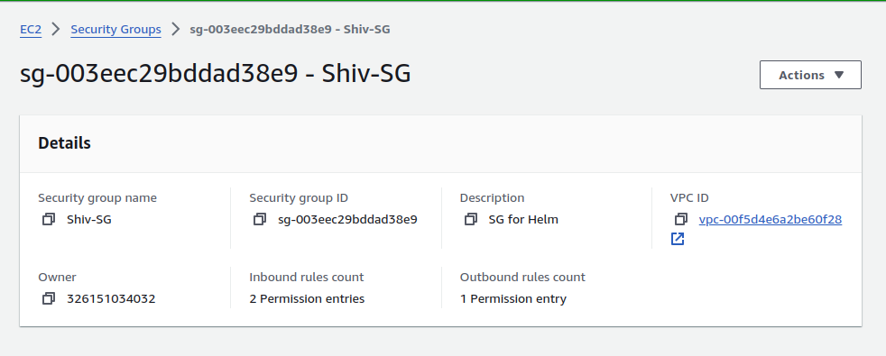

## README: Deploying a Multi-Tier Application Using Helm on Kubernetes and AWS Free Tier Services

### Overview

This project involves deploying a multi-tier application using Helm on Minikube and integrating AWS free-tier services such as S3 and RDS (MySQL). The key objectives include managing Helm charts, secrets, and Role-Based Access Control (RBAC) while utilizing AWS services for storage and database needs. The project emphasizes proper versioning, packaging, rollback management, and cloud resource management.

**Estimated Duration:** 2 Hours

### Project Objectives

- Deploy a multi-tier application using Helm on Minikube.
- Integrate AWS free-tier services (S3 and RDS).
- Manage Helm charts, including versioning, packaging, and rollbacks.
- Implement Helm secrets management and RBAC.
- Handle dependencies between different application components.

### Project Deliverables

1. **Setup Helm and Minikube**
   - Ensure Minikube is running.
   - Install and configure Helm on the local machine.

2. **AWS Services Setup**
   - **S3 Bucket:** Create an S3 bucket for storing application assets (e.g., static files for the frontend).
   
   - **RDS Instance:** Set up an Amazon RDS MySQL instance in the free tier.

3. **Create Helm Charts**
   - **Frontend Chart:** Create a Helm chart for a frontend service (e.g., NGINX) that pulls static files from the S3 bucket.
   - **Backend Chart:** Create a Helm chart for a backend service (e.g., a Python Flask API) that connects to the RDS MySQL database.
   - **Database Chart:** Include configurations for connecting to the RDS MySQL instance in the backend chart.

4. **Package Helm Charts**
   - Package each Helm chart into a `.tgz` file.
   - Ensure charts are properly versioned.

5. **Deploy Multi-Tier Application Using Helm**
   - Deploy the database chart (connected to the RDS instance).
   - Deploy the backend chart with a dependency on the database chart.
   - Deploy the frontend chart with a dependency on the backend service, ensuring it pulls assets from the S3 bucket.

6. **Manage Helm Secrets**
   - Implement Helm secrets for managing sensitive data, such as database credentials and S3 access keys.
   - Update the backend chart to use these secrets for connecting to the RDS instance and S3.

7. **Implement RBAC**
   - Define RBAC roles and role bindings to manage permissions for Helm deployments.
   - Ensure that only authorized users can deploy or modify the Helm releases.

8. **Versioning and Rollback**
   - Update the version of one of the Helm charts (e.g., update the frontend service).
   - Perform a rollback if necessary and validate the application's functionality.

9. **Validate Deployment**
   - Ensure the frontend service is serving files from the S3 bucket.
   - Validate that the backend service is successfully communicating with the RDS MySQL database.
   - Test the overall functionality of the deployed application.

10. **Cleanup**
    - Delete all Helm releases and Kubernetes resources created during the project.
    - Terminate the RDS instance and delete the S3 bucket.
    - Stop Minikube if no longer needed.

### Key Evaluation Criteria

- Proper setup and usage of Helm charts, including versioning, packaging, and integrating AWS services.
- Effective management of secrets and implementation of RBAC in the Kubernetes environment.
- Successful deployment and integration of the application with AWS services (S3 and RDS).
- Correct handling of application rollbacks and version updates.
- Proper cleanup of all resources, both in Kubernetes and AWS, after the activity.

### Conclusion

By completing this project, you will gain hands-on experience with Helm and Kubernetes, managing cloud resources on AWS, and implementing best practices for deploying and managing multi-tier applications in a Kubernetes environment.