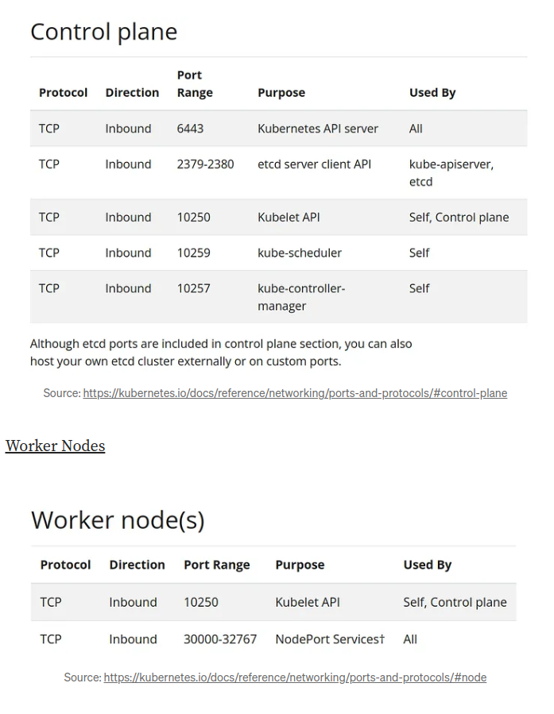

## FOR ALL NODES
#### Step-1: disable swap
```bash
sudo swapoff -a
sudo sed -i '/swap/s/^/#/' /etc/fstab
```

#### Step-2: Create the .conf file to load the modules at bootup
```bash
cat <<EOF | sudo tee /etc/modules-load.d/k8s.conf
overlay
br_netfilter
EOF
```
```bash
sudo modprobe overlay
sudo modprobe br_netfilter
```

#### Step-3: sysctl params required by setup, params persist across reboots
```bash
cat <<EOF | sudo tee /etc/sysctl.d/k8s.conf
net.bridge.bridge-nf-call-iptables  = 1
net.bridge.bridge-nf-call-ip6tables = 1
net.ipv4.ip_forward                 = 1
EOF
```

#### Step-4: Apply sysctl params without reboot
```bash
sudo sysctl --system
```

#### Step-5: Update the package repository 
```bash
sudo apt-get update
```
#### Step-6: Install Containerd
```bash
sudo apt update -y ; sudo apt-get install containerd -y
sudo mkdir -p /etc/containerd
containerd config default | sudo tee /etc/containerd/config.toml 
sudo sed -i "s/SystemdCgroup = false/SystemdCgroup = true/g" /etc/containerd/config.toml 
sudo systemctl restart containerd
```

#### Step-7 Update the apt package index and install packages needed to use the Kubernetes apt repository:
```bash
sudo apt-get update
```
#### Step-8: apt-transport-https may be a dummy package; if so, you can skip that package
```bash
sudo apt-get install -y apt-transport-https ca-certificates curl gpg
```
#### Step-9: Download the public signing key for the Kubernetes package repositories. The same signing key is used for all repositories so you can disregard the version in the URL:
If the directory `/etc/apt/keyrings` does not exist, it should be created before the curl command, read the note below.
```bash
sudo mkdir -p -m 755 /etc/apt/keyrings
```
```bash
curl -fsSL https://pkgs.k8s.io/core:/stable:/v1.30/deb/Release.key | sudo gpg --dearmor -o /etc/apt/keyrings/kubernetes-apt-keyring.gpg
```
#### Step-10: This overwrites any existing configuration in /etc/apt/sources.list.d/kubernetes.list
```bash
echo 'deb [signed-by=/etc/apt/keyrings/kubernetes-apt-keyring.gpg] https://pkgs.k8s.io/core:/stable:/v1.30/deb/ /' | sudo tee /etc/apt/sources.list.d/kubernetes.list
```
#### Step-11: Update the apt package index, install kubelet, kubeadm and kubectl, and pin their version:
```bash
sudo apt-get update
sudo apt-get install -y kubelet kubeadm kubectl
sudo apt-mark hold kubelet kubeadm kubectl
```

#### (Optional) Enable the kubelet service before running kubeadm:
```bash
sudo systemctl enable --now kubelet
```

## ONLY FOR MASTER NODE

#### Initiate the Cluster
```bash
kubeadm init --pod-network-cidr 192.168.0.0/16
```


#### Your Kubernetes control-plane has initialized successfully!

#### To start using your cluster, you need to run the following as a regular user:
```bash
mkdir -p $HOME/.kube
sudo cp -i /etc/kubernetes/admin.conf $HOME/.kube/config
sudo chown $(id -u):$(id -g) $HOME/.kube/config
```

#### (Optional) On the Control Plane Node, Create the Token and Copy the Join Command:
```bash
kubeadm token create --print-join-command
```

***NOTE:***

*If you are using Cloud setup, please configure inbound rules*

*Following are the port range for each Kubernetes components*

