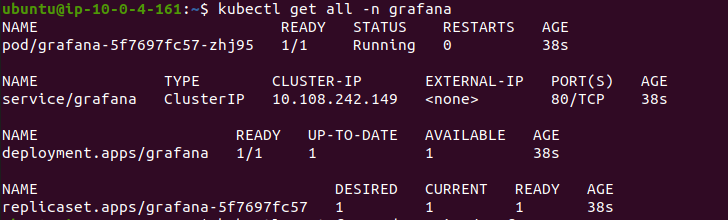

# Deploying a Kubernetes Application with Monitoring on AWS

## Project Overview
This project involves deploying a Kubernetes application on AWS EC2 instances and setting up a monitoring stack using Prometheus and Grafana. The goal is to monitor the application's performance and visualize metrics using Grafana dashboards. You will learn to deploy and configure monitoring solutions in a Kubernetes environment on AWS.

## Project Objectives
1. Deploy a Kubernetes cluster on EC2 instances.
2. Install Prometheus to monitor Kubernetes cluster metrics.
3. Install Grafana and configure it to visualize metrics from Prometheus.
4. Create custom Grafana dashboards to monitor specific application metrics.
5. Set up alerts in Grafana based on specific thresholds.
6. Terminate all AWS resources after completing the project.

## Project Requirements
- **AWS EC2 Instances**: Launch a minimum of 3 `t2.micro` instances for the Kubernetes master and worker nodes.
- **Kubernetes Cluster**: Set up a Kubernetes cluster using Kubeadm on the EC2 instances.
- **Prometheus**: Deploy Prometheus on the Kubernetes cluster to collect metrics.
- **Grafana**: Deploy Grafana on the Kubernetes cluster and configure it to use Prometheus as a data source.
- **Custom Dashboards**: Create custom Grafana dashboards to monitor application metrics.
- **Alerting**: Set up basic alerts in Grafana for key metrics (e.g., CPU usage, memory usage).
- **Termination**: Ensure all AWS resources are terminated after the project is complete.

## Step-by-Step Project Tasks

### 1. Launch AWS EC2 Instances (20 Minutes)
- **Task**: Launch three EC2 instances of type `t2.micro` in the same VPC and availability zone.
- **Solution**:
  - Go to the AWS Management Console.
  - Launch three EC2 instances of type `t2.micro` in the same VPC and availability zone.
  - Configure security groups to allow:
    - SSH access (port 22).
    - Necessary ports for Kubernetes, Prometheus, and Grafana (e.g., ports 9090, 3000).
  - SSH into the instances and update the package manager using:
    ```bash
    sudo apt update && sudo apt upgrade -y
    ```
    

### 2. Set Up a Kubernetes Cluster (30 Minutes)
- **Task**: Set up a Kubernetes cluster using Kubeadm on the EC2 instances.
- **Solution**:
  - On the master node, install Kubeadm, Kubelet, and Kubectl:
    ```bash
    sudo apt install -y kubeadm kubelet kubectl
    ```
  - Initialize the Kubernetes cluster:
    ```bash
    sudo kubeadm init --pod-network-cidr 192.168.0.0/16 --kubernetes-version 1.27.11
    ```
  - Configure the Kubernetes cluster:
    ```bash
    mkdir -p $HOME/.kube
    sudo cp -i /etc/kubernetes/admin.conf $HOME/.kube/config
    sudo chown $(id -u):$(id -g) $HOME/.kube/config
    ```
  - Join worker nodes to the cluster using the `kubeadm join` command provided by the master node.
  - Verify the cluster setup:
    ```bash
    kubectl get nodes
    ```
    

### 3. Deploy Prometheus on Kubernetes (20 Minutes)
- **Task**: Deploy Prometheus on the Kubernetes cluster.
- **Solution**:
  - Create a Kubernetes namespace for prometheus:
    ```bash
    kubectl create namespace prometheus
    ```
  - Deploy Prometheus using Helm or Kubernetes manifests:
    ```bash
    helm install prometheus prometheus-community/prometheus -f ~/prometheus-values.yml --namespace prometheus
    ```
    
  - Verify Prometheus is collecting metrics:
    ```bash
    kubectl get all -n prometheus
    ```
    

### 4. Deploy Grafana on Kubernetes (20 Minutes)
- **Task**: Deploy Grafana and configure it to use Prometheus as a data source.
- **Solution**:
  - Create a Kubernetes namespace for grafana:
    ```bash
    kubectl create namespace grafana
    ```
  - Deploy Grafana in the monitoring namespace:
    ```bash
    helm install grafana grafana/grafana --namespace grafana
    ```
    

  - Verify Prometheus is collecting metrics:
    ```bash
    kubectl get all -n grafana
    ```
    

  - Access Grafana using port forwarding.
    
    
  - Configure Grafana to use Prometheus as a data source in the Grafana UI.

    

### 5. Create and Configure Custom Dashboards (20 Minutes)
- **Task**: Create custom Grafana dashboards to monitor key metrics.
- **Solution**:
  - Open Grafana and log in.
  - Add new dashboards to monitor CPU usage, memory usage, pod status, and network traffic.
  - Save and share the dashboards for future use.
  

### 6. Clean Up Resources (10 Minutes)
- **Task**: Terminate all AWS resources used in the project.
- **Solution**:
  - Delete all Kubernetes resources (Prometheus, Grafana, and sample application):
    ```bash
    kubectl delete namespace prometheus
    kubectl delete namespace grafana
    ```
  - Terminate all EC2 instances from the AWS Management Console to avoid unnecessary charges.

## Deliverables
1. **Kubernetes Cluster**: A functioning Kubernetes cluster with at least one master node and two worker nodes.
2. **Prometheus Deployment**: Prometheus deployed on the Kubernetes cluster, collecting metrics.
3. **Grafana Deployment**: Grafana deployed on the Kubernetes cluster, configured with Prometheus as a data source.
4. **Custom Dashboards**: Custom Grafana dashboards displaying relevant metrics.
5. **Alerting Setup**: Basic alerting rules configured in Grafana.
6. **Clean-Up**: All AWS resources terminated upon completion.

---

This README provides a comprehensive guide for completing your project, from deployment to monitoring and cleanup.