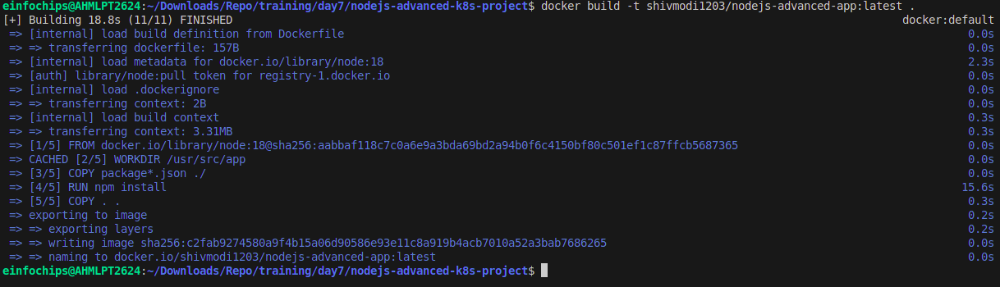

# Project 01: Node.js Application Deployment on Kubernetes

In this project, you will develop a simple Node.js application, deploy it on a local Kubernetes cluster using Minikube, and configure various Kubernetes features. The project includes Git version control practices, creating and managing branches, and performing rebases. Additionally, you will work with ConfigMaps, Secrets, environment variables, and set up vertical and horizontal pod autoscaling.

## Project Steps

### 1. Setup Minikube and Git Repository

#### 1.1 Start Minikube:
```sh
minikube start
```

#### 1.2 Set Up Git Repository
Create a new directory for your project:
```sh
mkdir nodejs-k8s-project
cd nodejs-k8s-project
```

Initialize Git repository:
```sh
git init
```

Create a `.gitignore` file:
```
node_modules/
.env
```

Add and commit initial changes:
```sh
git add .
git commit -m "Initial commit"
```

### 2. Develop a Node.js Application

#### 2.1 Create the Node.js App
Initialize the Node.js project:
```sh
npm init -y
```

Install necessary packages:
```sh
npm install express body-parser
```

Create `app.js`:
```javascript
const express = require('express');
const bodyParser = require('body-parser');
const app = express();
const PORT = process.env.PORT || 3000;

app.use(bodyParser.json());

app.get('/', (req, res) => {
  res.send('Hello, World!');
});

app.listen(PORT, () => {
  console.log(`Server is running on port ${PORT}`);
});
```

Update `package.json` to include a start script:
```json
"scripts": {
  "start": "node app.js"
}
```

#### 2.2 Commit the Node.js Application
Add and commit changes:
```sh
git add .
git commit -m "Add Node.js application code"
```

### 3. Create Dockerfile and Docker Compose

#### 3.1 Create a Dockerfile
Add `Dockerfile`:
```Dockerfile
# Use official Node.js image
FROM node:18

# Set the working directory
WORKDIR /usr/src/app

# Copy package.json and package-lock.json
COPY package*.json ./

# Install dependencies
RUN npm install

# Copy the rest of the application code
COPY . .

# Expose the port on which the app runs
EXPOSE 3000

# Command to run the application
CMD [ "npm", "start" ]
```

Create a `.dockerignore` file:
```
node_modules
.npm
```

#### 3.2 Create docker-compose.yml (optional for local testing)
Add `docker-compose.yml`:
```yaml
version: '3'
services:
  app:
    build: .
    ports:
      - "3000:3000"
```

Add and commit changes:
```sh
git add Dockerfile docker-compose.yml
git commit -m "Add Dockerfile and Docker Compose configuration"
```

### 4. Build and Push Docker Image

#### 4.1 Build Docker Image
Build the Docker image:
```sh
docker build -t nodejs-app:latest .
```


#### 4.2 Push Docker Image to Docker Hub
Tag and push the image:
```sh
docker tag nodejs-app:latest your-dockerhub-username/nodejs-app:latest
docker push your-dockerhub-username/nodejs-app:latest
```


Add and commit changes:
```sh
git add .
git commit -m "Build and push Docker image"
```

### 5. Create Kubernetes Configurations

#### 5.1 Create Kubernetes Deployment
Create `kubernetes/deployment.yaml`:
```yaml
apiVersion: apps/v1
kind: Deployment
metadata:
  name: nodejs-app-deployment
spec:
  replicas: 2
  selector:
    matchLabels:
      app: nodejs-app
  template:
    metadata:
      labels:
        app: nodejs-app
    spec:
      containers:
      - name: nodejs-app
        image: your-dockerhub-username/nodejs-app:latest
        ports:
        - containerPort: 3000
        env:
        - name: PORT
          valueFrom:
            configMapKeyRef:
              name: app-config
              key: PORT
        - name: NODE_ENV
          valueFrom:
            secretKeyRef:
              name: app-secrets
              key: NODE_ENV
```

#### 5.2 Create ConfigMap and Secret
Create `kubernetes/configmap.yaml`:
```yaml
apiVersion: v1
kind: ConfigMap
metadata:
  name: app-config
data:
  PORT: "3000"
```

Create `kubernetes/secret.yaml`:
```yaml
apiVersion: v1
kind: Secret
metadata:
  name: app-secrets
type: Opaque
data:
  NODE_ENV: cHJvZHVjdGlvbmFs # Base64 encoded value for "production"
```

Add and commit Kubernetes configurations:
```sh
git add kubernetes/
git commit -m "Add Kubernetes deployment, configmap, and secret"
```


#### 5.3 Apply Kubernetes Configurations
Apply the ConfigMap and Secret:
```sh
kubectl apply -f kubernetes/configmap.yaml
kubectl apply -f kubernetes/secret.yaml
```


Apply the Deployment:
```sh
kubectl apply -f kubernetes/deployment.yaml
```

### 6. Implement Autoscaling

#### 6.1 Create Horizontal Pod Autoscaler
Create `kubernetes/hpa.yaml`:
```yaml
apiVersion: autoscaling/v2beta2
kind: HorizontalPodAutoscaler
metadata:
  name: nodejs-app-hpa
spec:
  scaleTargetRef:
    apiVersion: apps/v1
    kind: Deployment
    name: nodejs-app-deployment
  minReplicas: 2
  maxReplicas: 5
  metrics:
  - type: Resource
    resource:
      name: cpu
      target:
        type: Utilization
        averageUtilization: 50
```

Apply the HPA:
```sh
kubectl apply -f kubernetes/hpa.yaml
```

#### 6.2 Create Vertical Pod Autoscaler
Create `kubernetes/vpa.yaml`:
```yaml
apiVersion: autoscaling.k8s.io/v1beta2
kind: VerticalPodAutoscaler
metadata:
  name: nodejs-app-vpa
spec:
  targetRef:
    apiVersion: apps/v1
    kind: Deployment
    name: nodejs-app-deployment
  updatePolicy:
    updateMode: "Auto"
```

Apply the VPA:
```sh
kubectl apply -f kubernetes/vpa.yaml
```

### 7. Test the Deployment

#### 7.1 Check the Status of Pods, Services, and HPA
Verify the Pods:
```sh
kubectl get pods
```


Verify the Services:
```sh
kubectl get svc
```


Verify the HPA:
```sh
kubectl get hpa
```


#### 7.2 Access the Application
Expose the Service:
```sh
kubectl expose deployment nodejs-app-deployment --type=NodePort --name=nodejs-app-service
```


Get the Minikube IP and Service Port:
```sh
minikube service nodejs-app-service --url
```


Access the Application in your browser using the URL obtained from the previous command.

### 8. Git Version Control

#### 8.1 Create a New Branch for New Features
Create and switch to a new branch:
```sh
git checkout -b feature/new-feature
```

Make changes and commit:
```sh
# Make some changes
git add .
git commit -m "Add new feature"
```

Push the branch to the remote repository:
```sh
git push origin feature/new-feature
```

#### 8.2 Rebase Feature Branch on Main Branch
Switch to the main branch and pull the latest changes:
```sh
git checkout main
git pull origin main
```

Rebase the feature branch:
```sh
git checkout feature/new-feature
git rebase main
```

Resolve conflicts if any, and continue the rebase:
```sh
git add .
git rebase --continue
```

Push the rebased feature branch:
```sh
git push origin feature/new-feature --force
```

### 9. Final Commit and Cleanup

#### 9.1 Merge feature branch to main:
```sh
git checkout main
git merge feature/new-feature
```

Push the changes to the main branch:
```sh
git push origin main
```

Clean up:
```sh
git branch -d feature/new-feature
git push origin --delete feature/new-feature
```

---

# Project 02: Advanced Node.js Application Deployment on Kubernetes

Deploy a Node.js application to Kubernetes with advanced usage of ConfigMaps and Secrets. Implement Horizontal Pod Autoscaler (HPA) with both scale-up and scale-down policies. The project will include a multi-environment configuration strategy, integrating a Redis cache, and monitoring application metrics.

## Project Setup

### 1. Initialize a Git Repository
Create a new directory for your project and initialize Git:
```sh
mkdir nodejs-advanced-k8s-project
cd nodejs-advanced-k8s-project
git init
```

### 2. Create Initial Files
Create the initial Node.js application and Docker-related files:
```sh
npm init -y
npm install express redis body-parser
```


### `app.js`

This file contains the Node.js application code:

```javascript
const express = require('express');
const bodyParser = require('body-parser');
const redis = require('redis');
const app = express();
const PORT = process.env.PORT || 3000;

// Connect to Redis
const redisClient = redis.createClient({
  url: `redis://${process.env.REDIS_HOST}:${process.env.REDIS_PORT}`
});
redisClient.on('error', (err) => console.error('Redis Client Error', err));

app.use(bodyParser.json());

app.get('/', async (req, res) => {
  const visits = await redisClient.get('visits');
  if (visits) {
    await redisClient.set('visits', parseInt(visits) + 1);
  } else {
    await redisClient.set('visits', 1);
  }
  res.send(`Hello, World! You are visitor number ${visits || 1}`);
});

app.listen(PORT, () => {
  console.log(`Server is running on port ${PORT}`);
});
```

### `Dockerfile`

This file contains the Dockerfile to containerize the Node.js application:

```Dockerfile
FROM node:18

WORKDIR /usr/src/app

COPY package*.json ./

RUN npm install

COPY . .

EXPOSE 3000

CMD ["npm", "start"]
```

### `.dockerignore`

This file contains the Docker ignore file:

```
node_modules
.npm
```

## Building and Pushing Docker Image

1. Build the Docker image:

   ```bash
   docker build -t your-dockerhub-username/nodejs-advanced-app:latest .
   ```

   

2. Push the Docker image to Docker Hub:

   ```bash
   docker push your-dockerhub-username/nodejs-advanced-app:latest
   ```

   

## Kubernetes Configuration

### Apply Kubernetes Configurations

Apply the Kubernetes configurations:

```bash
kubectl apply -f kubernetes/
```


### Access the Application

Access the application via Minikube:

```bash
minikube service nodejs-advanced-app-service --url
```


## Advanced Kubernetes Configuration

### Deployment Configuration

Create `kubernetes/deployment.yaml` to deploy the Node.js application with Redis dependency:

```yaml
apiVersion: apps/v1
kind: Deployment
metadata:
  name: nodejs-advanced-app-deployment
spec:
  replicas: 2
  selector:
    matchLabels:
      app: nodejs-advanced-app
  template:
    metadata:
      labels:
        app: nodejs-advanced-app
    spec:
      containers:
      - name: nodejs-advanced-app
        image: your-dockerhub-username/nodejs-advanced-app:latest
        ports:
        - containerPort: 3000
        env:
        - name: PORT
          valueFrom:
            configMapKeyRef:
              name: app-config
              key: PORT
        - name: REDIS_HOST
          valueFrom:
            configMapKeyRef:
              name: redis-config
              key: REDIS_HOST
        - name: REDIS_PORT
          valueFrom:
            configMapKeyRef:
              name: redis-config
              key: REDIS_PORT
        - name: NODE_ENV
          valueFrom:
            secretKeyRef:
              name: app-secrets
              key: NODE_ENV
      - name: redis
        image: redis:latest
        ports:
        - containerPort: 6379
```

### ConfigMap for Application and Redis

Create `kubernetes/configmap.yaml` to manage application and Redis configurations:

```yaml
apiVersion: v1
kind: ConfigMap
metadata:
  name: app-config
data:
  PORT: "3000"
---
apiVersion: v1
kind: ConfigMap
metadata:
  name: redis-config
data:
  REDIS_HOST: "redis"
  REDIS_PORT: "6379"
```

### Secret for Sensitive Data

Create `kubernetes/secret.yaml` to manage sensitive environment variables:

```yaml
apiVersion: v1
kind: Secret
metadata:
  name: app-secrets
type: Opaque
data:
  NODE_ENV: cHJvZHVjdGlvbg== # Base64 encoded value for "production"
```

### Service Configuration

Create `kubernetes/service.yaml` to expose the Node.js application:

```yaml
apiVersion: v1
kind: Service
metadata:
  name: nodejs-advanced-app-service
spec:
  selector:
    app: nodejs-advanced-app
  ports:
  - protocol: TCP
    port: 80
    targetPort: 3000
  type: LoadBalancer
```

### Horizontal Pod Autoscaler with Scale-Up and Scale-Down Policies

Create `kubernetes/hpa.yaml` to manage autoscaling:

```yaml
apiVersion: autoscaling/v2beta2
kind: HorizontalPodAutoscaler
metadata:
  name: nodejs-advanced-app-hpa
spec:
  scaleTargetRef:
    apiVersion: apps/v1
    kind: Deployment
    name: nodejs-advanced-app-deployment
  minReplicas: 2
  maxReplicas: 5
  metrics:
  - type: Resource
    resource:
      name: cpu
      target:
        type: Utilization
        averageUtilization: 50
  - type: Resource
    resource:
      name: memory
      target:
        type: Utilization
        averageUtilization: 70
  behavior:
    scaleUp:
      stabilizationWindowSeconds: 30
      selectPolicy: Max
      policies:
      - type: Pods
        value: 2
        periodSeconds: 30
      - type: Resource
        resource: cpu
        value: 2
        periodSeconds: 30
    scaleDown:
      stabilizationWindowSeconds: 30
      selectPolicy: Min
      policies:
      - type: Pods
        value: 1
        periodSeconds: 30
      - type: Resource
        resource: memory
        value: 1
        periodSeconds: 30
```

### Vertical Pod Autoscaler Configuration

Create `kubernetes/vpa.yaml` to manage vertical scaling:

```yaml
apiVersion: autoscaling.k8s.io/v1beta2
kind: VerticalPodAutoscaler
metadata:
  name: nodejs-advanced-app-vpa
spec:
  targetRef:
    apiVersion: apps/v1
    kind: Deployment
    name: nodejs-advanced-app-deployment
  updatePolicy:
    updateMode: "Auto"
```

### Redis Deployment

Add a Redis deployment configuration to `kubernetes/redis-deployment.yaml`:

```yaml
apiVersion: apps/v1
kind: Deployment
metadata:
  name: redis-deployment
spec:
  replicas: 1
  selector:
    matchLabels:
      app: redis
  template:
    metadata:
      labels:
        app: redis
    spec:
      containers:
      - name: redis
        image: redis:latest
        ports:
        - containerPort: 6379
```

Add Redis service configuration to `kubernetes/redis-service.yaml`:

```yaml
apiVersion: v1
kind: Service
metadata:
  name: redis-service
spec:
  selector:
    app: redis
  ports:
  - protocol: TCP
    port: 6379
    targetPort: 6379
  type: ClusterIP
```

### Apply Kubernetes Configurations

Apply all configurations to your Minikube cluster:

```bash
kubectl apply -f kubernetes/redis-deployment.yaml
kubectl apply -f kubernetes/redis-service.yaml
kubectl apply -f kubernetes/configmap.yaml
kubectl apply -f kubernetes/secret.yaml
kubectl apply -f kubernetes/deployment.yaml
kubectl apply -f kubernetes/service.yaml
kubectl apply -f kubernetes/hpa.yaml
kubectl apply -f kubernetes/vpa.yaml
```


### Verify Deployments and Services

Check the status of your deployments and services:

```bash
kubectl get all
```

Access the application via Minikube:

```bash
minikube service nodejs-advanced-app-service --url
```

### Testing Scaling

Simulate load on the application to test the HPA:

```bash
kubectl run -i --tty --rm load-generator --image=busybox --restart=Never -- /bin/sh
# Inside the pod, run the following command to generate load
while true; do wget -q -O- http://nodejs-advanced-app-service; done
```

### Validate Autoscaling Behavior

Observe the HPA behavior:

```bash
kubectl get hpa
```

Watch the scaling events and verify that the application scales up and down based on the policies you configured.

## Project Wrap-Up

### Review and Clean Up

After completing the project, review the configurations and clean up the Minikube environment if needed:

```bash
minikube delete
```

---